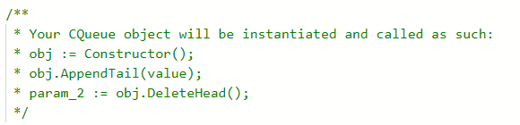
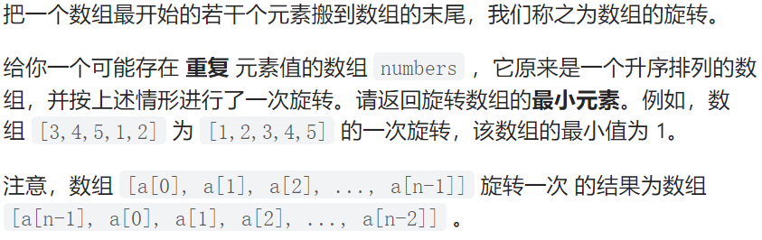
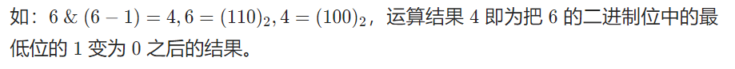
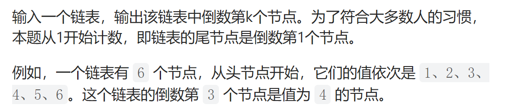
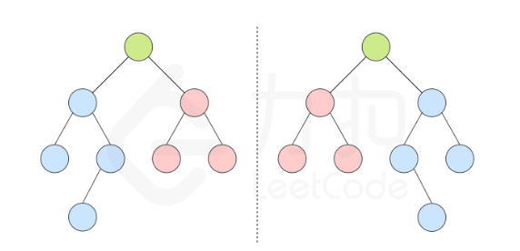
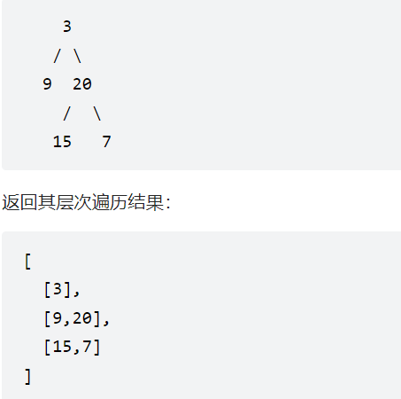

# 简单

## 1、数组中的重复数字

###标签：数组、哈希表、排序

题目：找出数组中重复的数字。


在一个长度为 n 的数组 nums 里的所有数字都在 0～n-1 的范围内。数组中某些数字是重复的，但不知道有几个数字重复了，也不知道每个数字重复了几次。请找出数组中**任意一个**重复的数字（找出一个就行）。

**示例 1：**

```
输入：
[2, 3, 1, 0, 2, 5, 3]
输出：2 或 3 
```

解题：

```go
func findRepeatNumber(nums []int) int {
	// 该算法利用哈希表 时间复杂度为O(n) 空间复杂度为O(n)
    
	// bool 的初始值都是false，int的初始值是0
    // 构建了一个hash map
	c := make(map[int]bool)
	// 
	for i := 0; i < len(nums); i++ {
        
		if c[nums[i]] {
			return nums[i]
		}
        // 直接对map中的元素进行赋值更改
		c[nums[i]] = true
	}
	return -1
}
```


## 2 替换空格

### 标签：字符串

题目：请实现一个函数，把字符串 `s` 中的每个空格替换成"%20"。

**示例 1：**

```
输入：s = "We are happy."
输出："We%20are%20happy."
```

解题：

```go
func replaceSpace(s string) string{
    var th string = `%20`
    
    for i := 0; i < len(s); i++{
        if s[i] == ' '{
            // 字符串不支持修改, 需要赋值给其他字符串
            s = s[:i] + th + s[i + 1:]
        }
    }
    return s
}
```


## 3 从尾到头打印链表

### 标签:栈 递归 链表 双指针

题目：输入一个链表的头节点，从尾到头反过来返回每个节点的值（用数组返回）。

**示例 1：**

```
输入：head = [1,3,2]
输出：[2,3,1]
```

解题：

```go
/**
 * Definition for singly-linked list.
 * type ListNode struct {
 *     Val int
 *     Next *ListNode
 * }
 */
// 递归算法 简单易懂
// 因为要的就是一个[]int类型的切片，所以，在后面直接append需要的值就行
// 执行到最后一个节点，然后取点，递归就好
func reversePrint(head *ListNode) []int {
    if head == nil {//递归结束条件
        return nil
    }
    return append(reversePrint(head.Next),head.Val)
}
```


## 4 用两个栈实现队列

###标签：栈、设计、队列

题目：用**两个栈实现一个队列**。队列的声明如下，请实现它的两个函数 appendTail 和 deleteHead ，分别完成在**队列尾部插入整数**和在**队列头部删除整数**的功能。(若队列中没有元素，deleteHead 操作返回 -1 )

**示例 1：**

```go
输入：
["CQueue","appendTail","deleteHead","deleteHead"]
[[],[3],[],[]]
输出：[null,null,3,-1]
```

解题思路：双栈

将一个栈当作输入栈，用于压入**appendTail**传入的数据；另一个栈当作输出栈，用于**deleteHead 操作**。

每次 deleteHead 时，**若输出栈为空**

​										**则将输入栈的全部数据依次弹出并压入输出栈**。

这样输出栈，从栈顶往栈底的顺序----》就是队列，从队首往队尾的顺序

原始模板：

```go
type CQueue struct {

}


func Constructor() CQueue {

}


func (this *CQueue) AppendTail(value int)  {

}


func (this *CQueue) DeleteHead() int {

}

```




解题：

```go 
// 定义一个包含两个栈的结构体
type CQueue struct {
    inStack, outStack []int
}
// 定义一个函数用来返回这个结构体
func Constructor() CQueue {
    return CQueue{}
}
// 定义这个结构体的AppendTail方法
func (this *CQueue) AppendTail(value int)  {
    // 将value压入栈中
    this.inStack = append(this.inStack, value)
}
// 定义这个结构体的DeleHead方法
func (this *CQueue) DeleteHead() int {
    // 如果输出栈没有元素
    if len(this.outStack) == 0 {
        // 如果输入栈没有元素
        if len(this.inStack) == 0 {
            return -1
        }
        // 如果输入栈中有元素，就把输入栈中的元素拼接到输出栈中
        this.in2out()
    }
    // 获取删除的这个值
    value := this.outStack[len(this.outStack)-1]
    // 删除输出栈中的最后一个元素
    this.outStack = this.outStack[:len(this.outStack)-1]
    return value
}
// 如果输入栈中有元素 ，就把输入栈中的元素拼接到输出栈中
func (this *CQueue) in2out() {
    for len(this.inStack) > 0 {
        this.outStack = append(this.outStack, this.inStack[len(this.inStack)-1])
        // 删除输入栈中的最后一个元素（因为已经存入到了输出栈中）
        this.inStack = this.inStack[:len(this.inStack)-1]
    }
}
```

## 5 斐波那契数列

### 标签：递归、取模、动态规划

题目：写一个函数，输入 n ，求斐波那契（Fibonacci）数列的第 n 项（即 F(N)）。斐波那契数列的定义如下：

```go
F(0) = 0,   F(1) = 1

F(N) = F(N - 1) + F(N - 2), 其中 N > 1.
```

斐波那契数列由 0 和 1 开始，之后的斐波那契数就是由之前的两数相加而得出。

**答案需要取模 1e9+7（1000000007）**，如计算初始结果为：1000000008，请返回 1

思路：这是一个很明显的动态规划题目，当然递归等方法也可以做出来

```go
// 题解中说这个是个动态规划，但是这个实际上 我理解更像一个没有链表的移动窗口，三个一组的移动，通过前两个数的相加获取第3个数的值
func fib(n int)int{
    const mod int = 1e9 + 7
    if n < 2{
        return n
    }
    q, p, r := 0, 0, 1
    for i:=2; i<=n; i++{
        //对q、p、r进行移动
        p = q
        q = r
        r = (p+q)%mod
    }
    return r
}

```


## 6 青蛙跳问题

### 标签：动态规划

题目：一只青蛙一次可以跳上1级台阶，也可以跳上2级台阶。求该青蛙跳上一个 n 级的台阶总共有多少种跳法。

答案需要**取模 1e9+7（1000000007）**，如计算初始结果为：1000000008，请返回 1。

解题思路：这个实际上也是一种斐波那契数据的变形

使用动态规划的方法来说，他的转移方程式为` dp[i+1]=dp[i]+dp[i−1]`，其实还是满足斐波那契数列。

初始状态：`dp[0]=1, dp[1]=1`，初始化的前两个数字

返回值：`dp[n]`

**示例 1：**

```
输入：n = 2
输出：2
```

解题：

```go
func numWays (n int) int {
    a, b, c:= 0,1,1
    for i :=2; i<=n ;i++{
		a = b
        b = c
        c = (a+b)%1000000007
    }
    return c
}
```

## 7 旋转数组的最小数字

### 标签：数组、二分查找

题目：



示例：

```go
输入：numbers = [3,4,5,1,2]
输出：1
```

解题思路：

没啥说的就是一个二分查找法，所谓二分查找发可以理解成一种特殊的双指针

```go
func minArray(numbers []int) int {
	// 利用二分查找 寻找最小值 可以达到双百
    low := 0
	high := len(numbers) - 1
	for low < high {
        // 中间坐标
		m := low + (high - low) / 2
        
        if numbers[m] < numbers[high] {
            high = m
        } else if numbers[m] > numbers[high] {
            low = m + 1
        } else {
            high--
        }
	}
	return numbers[low]
}
```


## 8 二进制中1的个数

### 标签：位运算

题目：编写一个函数，输入是一个无符号整数（以二进制串的形式），返回其二进制表达式中数字位数为 '1' 的个数（也被称为 [汉明重量](https://baike.baidu.com/item/%E6%B1%89%E6%98%8E%E9%87%8D%E9%87%8F/7110799)).）。

解题思路：这道题主要考虑的是位运算

`n&(n-1)`恰为把 n 的二进制位中的最低位的 1 变为 0 之后的结果。



在实际代码中，我们不断让当前的 n 与 n - 1 做与运算，**直到 n变为 0即可**。因为每次运算会使得 n 的最低位的 1 被翻转，因此运算次数就等于 n的二进制位中 1 的个数。

代码：

```go
func hammingWeight(num uint32) (ones int) {
    for ; num > 0; num &= num - 1 {
        ones++
    }
    return
}
```

## 9 打印从1到最大的n位数

### 标签：数组、大数

题目：输入数字 `n`，按顺序打印出从 1 到最大的 n 位十进制数。比如输入 3，则打印出 1、2、3 一直到最大的 3 位数 999。

解题思路:

实际上，本题的主要考点是**大数越界情况下的打印**。(应考虑使用字符串)

```go
func printNumbers(n int) []string {
	base := []string{}
	// 提前准备好0-9,10个数的字符，其他字符，慢慢append拼接
	for i := 0; i < 10; i++ {
		// strconv.Itoa将数字转换成字符串
		base = append(base, strconv.Itoa(i))
	}
	for l := 1; l <= n-1; l++ {
		// 创建一个长度为10的字符空数组，作为缓冲区
		tmp := make([]string, len(base))
		// 将base中的字符赋值给tmp
		copy(tmp, base)
		// 补齐位数。因为十以内的以及填完了，不需要在写了,所以+1
		digit := l + 1
        // 
		for i := 1; i < 10; i++ {
			for _, v := range tmp {
				diff_len := digit - len(v)
                // 控制补0
				tmp_0 := ""
				for x := 1; x < diff_len; x++ {
					tmp_0 += "0"
				}
				v = tmp_0 + v
				// 字符串拼接，通过这个i控制最高位的数字，v控制其他数字
				item := strconv.Itoa(i) + v
				// 存入这个到字符数组中
				base = append(base, item)
			}
		}
	}
	base = base[1:]
	fmt.Println((base))
	return base
}

```


## 10 删除链表中的节点

### 标签：递归

题目：给定单向链表的**头指针**和一个**要删除的节点的值**，定义一个函数删除该节点。

**返回删除后的链表的头节点。**题目保证链表中节点的值互不相同

解题思路：单纯的递归，**一定要学会分解最小的子问题**

解题：

```go
/**
 * Definition for singly-linked list.
 * type ListNode struct {
 *     Val int
 *     Next *ListNode
 * }
 */
func deleteNode(head *ListNode, val int) *ListNode {
    // 递归终止条件 如果找到了这个节点就返回他的下一个节点指向的指针。
    if head.val == val{
        return head.Next
    }
    // 以此遍历整个链表，当前节点的下一个节点---》
    head.Next = deleteNode(head.Next, val)
    return head
}
```


## 11 调整数组顺序使得奇数位于偶数前面

### 标签：双指针

题目：

输入一个整数数组，实现一个函数来调整该数组中数字的顺序，使得所有奇数在数组的前半部分，所有偶数在数组的后半部分。

示例：

```go
输入：nums = [1,2,3,4]
输出：[1,3,2,4] 
注：[3,1,2,4] 也是正确的答案之一。
```

解题思路：

直接首尾双指针，走到中间，循环结束，发现满足`nums[i]%2==0 && nums[j]%2!=0`就交换位置。

解题：

```go
func exchange(nums []int) []int {
		// 双指针,原地交换，不涉及到额外空间申请。
      	i,j:=0,len(nums)-1
      	for i<j {       //循环条件
          	if nums[i]%2==0 && nums[j]%2!=0{   //满足则发生交换
              	nums[i],nums[j]=nums[j],nums[i]
            }
            if nums[i]%2!=0{     //i往后走
				i++
            }
			if nums[j]%2==0{     //j往前走
				j--
            }
        }
        return nums
}
```


## 12 链表中倒数第k个节点

### 标签:快慢双指针



**示例：**

```
给定一个链表: 1->2->3->4->5, 和 k = 2.

返回链表 4->5.
```

解题思路：快慢双指针，让fast指针先走k步，low指针随后开始走，两个一起走，等fast走到最后的时候，low节点的位置就是链表中倒数第k个节点。

解题：

```go
/**
 * Definition for singly-linked list.
 * type ListNode struct {
 *     Val int
 *     Next *ListNode
 * }
 */
func getKthFromEnd(head *ListNode, k int) *ListNode {
    // 快慢双指针
    fast, low := head, head
    // 快指针先走k个步长
    for ; fast != nil && k > 0; k--{
        fast = fast.Next
    }
    // 直到fast节点指向空的时候结束
    for ;fast != nil;{
		fast = fast.Next
        low = low.Next
    }
    return low
}
```


## 13 翻转链表

### 标签：递归

题目：定义一个函数，输入一个链表的头节点，翻转该链表并输出反转链表的头节点

示例：

```go
输入: 1->2->3->4->5->NULL
输出: 5->4->3->2->1->NULL
```

解题思路：

递归到最后一个节点，然后输

解题：

```go
func reverseList(head *ListNode) * ListNode{
    if head==nil  || head.Next==nil{
        return head
    }
    // 返回最后一个节点
    newHead:=reverseList(head.Next)
    // 这种应该是(head.Next).Next = head，这样就实现了链表的翻转
    head.Next.Next=head
    // 断开原来的链接
    head.Next=nil
    // 将这个最后一个节点返回
    return newHead
}
```


## 14 二叉树的镜像

### 标签：递归

题目：完成一个函数，输入一个二叉树，该函数输出它的镜像

**示例 1：**

```
输入：root = [4,2,7,1,3,6,9]
输出：[4,7,2,9,6,3,1]
```

 解题思路：

对二叉树进行递归，从根节点开始。判断是否是镜像，需要判断左子树是否等于右子树

解题：

```go
/**
 * Definition for a binary tree node.
 * type TreeNode struct {
 *     Val int
 *     Left *TreeNode
 *     Right *TreeNode
 * }
 */
func mirrorTree(root *TreeNode) *TreeNode {
    if root == nil {
        return nil
    }
    // 递：找到最下层节点，左右的先后没关系
    left := mirrorTree(root.Left)
    right := mirrorTree(root.Right)
    // 左右对调
    root.Left = right
    root.Right = left
    // 归：将根节点返回
    return root
}
```


## 15 对称的二叉树

### 标签：递归

题目：请实现一个函数，用来判断一棵二叉树是不是对称的。如果一棵二叉树和它的镜像一样，那么它是对称的。

解题思路：参考14，二叉树的镜像，获取翻转后的二叉树之后，进行对比即可

什么时候两个树是互为镜像的？

两颗树的根节点具有相同的值

每个树的右子树与另一个树的左子树镜像对称 



解题：

```go
/**
 * Definition for a binary tree node.
 * type TreeNode struct {
 *     Val int
 *     Left *TreeNode	
 *     Right *TreeNode
 * }
 */
func isSymmetric(root *TreeNode) bool {
    if root == nil{
        return ture
    }
   	// 左右顺序并不影响结果的判断
    return recur(root.Left, root.Right)
}

func recur(left *TreeNode, right *TreeNode)bool{
    // 如果当前节点左右节点都是空节点，那么，就是镜像对称的(因为直到最后，也没有进入false，到最后左右几点都是)
    if left == nil && right == nil{
        return true
    }
    // 左空 或者 右空 或者 左右值不一样，那么肯定不是对称的
    if left == nil || right == nil || left.Val != right.Val {
        return false
    } 
    // 递归到下一层的关系，递归根节点的左右子树
    return recur(left.Left, right.Right) && recur(left.Right, right.Left)
}


```


官方题解

```go
func isSymmetric(root *TreeNode) bool {
    return check(root, root)
}

func check(p, q *TreeNode) bool {
    if p == nil && q == nil {
        return true
    }
    if p == nil || q == nil {
        return false
    }
    return p.Val == q.Val && check(p.Left, q.Right) && check(p.Right, q.Left) 
}
```


## 16 顺时针打印矩阵

### 标签：模拟

题目：

输入一个矩阵，按照从外向里以顺时针的顺序依次打印出每一个数字。

示例 1：

```go
输入：matrix = [[1,2,3],[4,5,6],[7,8,9]]
输出：[1,2,3,6,9,8,7,4,5]
```

解题思路：

 光标一直一直旋转移动即可，就是要把边界定义清晰明确。

解题：

```go
func spiralOrder(matrix [][]int) []int {
    n := len(matrix)
    if n == 0 {return []int{}}
    m := len(matrix[0])
    // 寻找边界
    left, right, up, bottom := 0, m-1, 0, n-1
    // 定义一个空切片
    res := []int{}
    // 定义一个叫add的函数变量
    add := func(x int) {res = append(res, x)}
    // 定义一个死循环
    for {
        // 从左到右将元素添加
        for j := left; j <= right; j++ {
            // 将矩阵中的元素加入结果列表
            add(matrix[up][j])
        }
        // 添加一层之后将光标下移
        up++
        // 需判断是否还有元素,如果矩阵没有元素就结束
        if up > bottom {break}
        // 从上到下添加元素
        for i := up; i <= bottom; i++ {
            // 将矩阵中的元素加入结果列表
            add(matrix[i][right])
        }
        // 光标左移
        right--
        if right < left{break}
		// 从右到左添加元素
        for j := right; j >= left; j-- {
            // 将矩阵中的元素加入结果列表
            add(matrix[bottom][j])
        }
        bottom--
        if up > bottom {break}
		// 从下到上添加元素
        for i := bottom; i >= up; i-- {
            // 将矩阵中的元素加入结果列表
            add(matrix[i][left])
        }
        left++
        if left > right{break}
        // 一次顺时针执行结束
    }
    // 最终将存储的返回结果返回
    return res
}
```


## 17 包含min函数的栈

### 标签：栈、设计

定义栈的数据结构，请在该类型中实现一个能够得到栈的最小元素的 min 函数在该栈中，**调用 min、push 及 pop 的时间复杂度都是 O(1)。**

设计思路：类似栈的

解题

```go
type MinStack struct {
    nums []int 	//储存栈
    min []int 	//辅助储存栈，存储最小值
}

/** initialize your data structure here. */
func Constructor() MinStack {
    return MinStack{
        make([]int,0,3),
        make([]int,0,3),
    }
}
// 将元素进栈
func (this *MinStack) Push(x int)  {
    this.nums=append(this.nums,x)
    if len(this.min)==0{
        this.min=append(this.min,x)
    }else if this.min[len(this.min)-1]<x{
        this.min=append(this.min,this.min[len(this.min)-1])
    }else{
        this.min=append(this.min,x)
    }
}

// 出栈（删掉栈顶元素）
func (this *MinStack) Pop()  {
    this.nums=this.nums[:len(this.nums)-1]
    this.min=this.min[:len(this.min)-1]
}

// 返回栈顶元素
func (this *MinStack) Top() int {
    return this.nums[len(this.nums)-1]
}

// 返回最小值元素
func (this *MinStack) Min() int {
    return this.min[len(this.min)-1]
}

/**
 * Your MinStack object will be instantiated and called as such:
 * obj := Constructor();
 * obj.Push(x);
 * obj.Pop();
 * param_3 := obj.Top();
 * param_4 := obj.Min();
 */

```


## 18  [从上到下打印二叉树 II](https://leetcode-cn.com/problems/cong-shang-dao-xia-da-yin-er-cha-shu-ii-lcof/)

### 标签：广度优先搜索

题目：

从上到下按层打印二叉树，同一层的节点按从左到右的顺序打印，每一层打印到一行。

例如:
给定二叉树: `[3,9,20,null,null,15,7]`



解题思路：

题目传入一个二叉树的头结点指针，需要返回一个二维数组

首先建立一个节点数组**nodeList用于存放树的节点**，初始时**将root放进去，长度为1**（因为不管什么树，只有一个根节点）

然后进入循环，记录**当前节点数组的长度**记为n，即为我要加入的这一层节点的长度

然后循环n次，每次将nodeList的首节点拿出来并将值放入levellist这个数组中并执行删除操作，删除nodeList的首结点并将该节点的左右节点入栈

循环l次后，levellist里就存放了一层的节点，将其append到res上，该层的所有节点都完成了删除并将左右子节点完成了入栈，继续执行大循环即可。

相当于就是刚开始根节点进入nodeList，长度为1，只循环一次，将根节点的值放入一个数组并加入到res中，在此过程中实现根节点的左右节点进入nodeList，并在nodeList首部删除根节点。第二次循环nodeList长度为2，将左右子节点的值取出放入数组中并加入res中，并实现左右子节点的左右子节点进入nodeList并删除左右子节点，以此类推。

解题

```go
/**
 * Definition for a binary tree node.
 * type TreeNode struct {
 *     Val int
 *     Left *TreeNode
 *     Right *TreeNode
 * }
 */
func levelOrder(root *TreeNode) [][]int {
    // 最后要返回这个res
    var res [][]int
    if root==nil{
        return res
    }
    nodeList:=[] *TreeNode{root} //节点数组用于节点的出入栈
    // 到节点数组中没有元素了，再循环结束
    for len(nodeList)!=0{
        l:=len(nodeList) // 长度为多少即该层有多少元素
        levellist:=[]int{}
        for i:=0;i<l;i++{
            node:=nodeList[0]
            levellist=append(levellist,node.Val) //值加入levellist
            nodeList=nodeList[1:]  //删除首节点，因为用完了，就不需要了
            // 题目要求从左到右，所以先左后右
            if node.Left != nil{  //左右节点加入nodelist
                nodeList = append(nodeList, node.Left)
            }
            if node.Right != nil{
                nodeList = append(nodeList, node.Right)
            }
        }
        res=append(res,levellist)  //该层的值数组加入res
    }
    return res
}
```


## 19 [剑指 Offer 39. 数组中出现次数超过一半的数字](https://leetcode-cn.com/problems/shu-zu-zhong-chu-xian-ci-shu-chao-guo-yi-ban-de-shu-zi-lcof/)

### 标签：摩尔投票法（不使用，map的线性），map

题目：数组中有一个数字出现的次数超过数组长度的一半，请找出这个数字

解决思路： 遍历该数组，统计每个int值出现次数，再遍历该数组，找出出现次数大于数组长度一半的int值。

这道题就应该用map

```go
func majorityElement(nums []int) int {
    // 建立map映射
	m :=make(map[int]int)
    // 
	t :=len(nums)/2
    // 如果
	for _,v:=range nums{
		if m[v]>=t{
            return v
        }
        m[v]++
    }
	return -1
}
```


## 20  top-K问题（最右面试题）

### 标签：排序

输入整数数组 `arr` ，找出其中最小的 `k` 个数。例如，输入4、5、1、6、2、7、3、8这8个数字，则最小的4个数字是1、2、3、4。

**示例 1：**

```go
输入：arr = [3,2,1], k = 2
输出：[1,2] 或者 [2,1]
```

解题：

解题思路：
一、用快排最最最高效解决 TopK 问题：
二、大根堆(前 K 小) / 小根堆（前 K 大),Java中有现成的 PriorityQueue，实现起来最简单：
三、二叉搜索树也可以 解决 TopK 问题哦
四、数据范围有限时直接计数排序就行了：

解题：

```go
func getLeastNumbers(arr []int, k int) []int {
    // 调用快排函数
    res:=quickSort(arr,0,len(arr)-1)
    return res[:k]
}
// 快排
func quickSort(arr []int,left,right int) []int{
    // 双指针
    if left>right{
        return nil
    }
    // 头指针，尾指针，光标值
    i,j,cur:=left,right,arr[left]
    for i<j{
        // 如果头尾指针没有相遇，并且尾指针的值仍然大于光标值
        // 跳出循环的时候，说明两个指针相遇了，或许
        for i<j && arr[j]>=cur{  
            // 尾指针向头走
            j--
        }
        
        // 如果头尾指针没有相遇，并且尾指针的值仍然大于光标值
        for i<j && arr[i]<=cur{
            i++
        }
        arr[i],arr[j]=arr[j],arr[i]  //交换
    }
    arr[i],arr[left]=arr[left],arr[i]  //交换选定的分界元素和左右分分界的arr[i]元素
    quickSort(arr,left,i-1)  //递归左边
    quickSort(arr,i+1,right) //递归右边
    return arr
}
```


### 1、冒泡排序

算法描述：

```go
//冒泡排序，a是数组，n表示数组大小
func BubbleSort(a []int, n int) {
	if n <= 1 {
		return
	}
	for i := 0; i < n; i++ {
		// 提前退出标志
		flag := false
		for j := 0; j < n-i-1; j++ {
			if a[j] > a[j+1] {
				a[j], a[j+1] = a[j+1], a[j]
				//此次冒泡有数据交换
				flag = true
			}
		}
		// 如果没有交换数据，提前退出
		if !flag {
			break
		}
	}
}
```


### 2、插入排序

算法描述：将待排序的数组划分为局部有序子数组subSorted和无序子数组subUnSorted，每次排序时从subUnSorted中挑出第一个元素，从后向前将其与subSorted各元素比较大小，按照大小插入合适的位置，插入完成后将此元素从subUnSorted中移除，重复这个过程直至subUnSorted中没有元素，总之就时从后向前，一边比较一边移动。

```go
func InsertionSort(a []int, n int) {
	if n <= 1 {
		return
	}
	for i := 1; i < n; i++ {
		value := a[i]
		j := i - 1
		//查找要插入的位置并移动数据
		for ; j >= 0; j-- {
			if a[j] > value {
				a[j+1] = a[j]
			} else {
				break
			}
		}
		a[j+1] = value
	}
}
```


### 3、选择排序

算法描述：首先在未排序序列中找到最小（大）元素，存放到排序序列的起始位置，然后，再从剩余未排序元素中继续寻找最小（大）元素，然后放到已排序序列的末尾。以此类推，直到所有元素均排序完毕。

```go
func SelectionSort(a []int, n int) {
	if n <= 1 {
		return
	}
	for i := 0; i < n; i++ {
		// 查找最小值
		minIndex := i
		for j := i + 1; j < n; j++ {
			if a[j] < a[minIndex] {
				minIndex = j
			}
		}
		// 交换
		a[i], a[minIndex] = a[minIndex],a[i]

	}
}

```


### 4、归并排序

算法描述：归并排序是建立在归并操作上的一种有效的排序算法。该算法是采用分治法（Divide and Conquer）的一个非常典型的应用。将已有序的子序列合并，得到完全有序的序列；即先使每个子序列有序，再使子序列段间有序。若将两个有序表合并成一个有序表，称为2-路归并。

```go
func MergeSort(n []int,start,end int){
	if start >= end {
		return
	}

	mid := (start+end)/2
	MergeSort(n,start,mid)
	MergeSort(n,mid+1,end)
	Merge(n,start,mid,end)
}

func Merge(n []int,start,mid,end int){
	var temp []int
	i := start
	k := mid + 1
	j := 0

	for ;i<=mid && k<=end;j++{
		if n[i] < n[k] {
			temp = append(temp,n[i])
			i++
		}else{
			temp = append(temp,n[k])
			k++
		}
	}

	if i > mid {
		temp=append(temp,n[k:end+1]...)
	}else{
		temp = append(temp,n[i:mid+1]...)
	}

	copy(n[start:end+1],temp)
}

```


### 5、希尔排序

算法描述：希尔排序基于插入排序发展而来。希尔排序的思想基于两个原因：

1. 当数据项数量不多的时候，插入排序可以很好的完成工作。

2. 当数据项基本有序的时候，插入排序具有很高的效率。

基于以上的两个原因就有了希尔排序的步骤：

1. 将待排序序列依据步长(增量)划分为若干组，对每组分别进行插入排序。初始时，step=len/2，此时的增量最大，因此每个分组内数据项个数相对较少，插入排序可以很好的完成排序工作（对应1）。
2. 以上只是完成了一次排序，更新步长step=step/2,每个分组内数据项个数相对增加，不过由于已经进行了一次排序，数据项基本有序，此时插入排序具有更好的排序效率(对应2)。直至增量为1时，此时的排序就是对这个序列使用插入排序，此次排序完成就表明排序已经完成。

```go
func ShellSort(n []int,len int){
	step := len/2
	for ; step > 0;step=step/2 {
		for i := step; i < len;i++ {
			j := i-step
			temp := n[i]
			for j>=0 && temp < n[j] {
				n[j+step] = n[j]
				j=j-step
			}
			n[j+step] = temp
		}
	}
}

```


### 6、快排

算法描述：快速排序的基本思想：通过一趟排序将待排记录分隔成独立的两部分，其中一部分记录的关键字均比另一部分的关键字小，则可分别对这两部分记录继续进行排序，以达到整个序列有序。

1. 在数组中，选择一个元素作为“基准”(pivot),一般选择第一个元素作为基准元素。设置两个游标i和j，初始时i指向数组首元素，j指向尾元素。
2. 从数组最右侧向前扫描，遇到小于基准值的元素停止扫描，将两者交换，然后从数组左侧开始扫描，遇到大于基准值的元素停止扫描，同样将两者交换。
3. i==j时分区完成，否则转2。
   

```go
func QuickSort(nums []int,start,end int){
	if start >= end {
		return
	}

	mid := partition(nums,start,end)
	QuickSort(nums,start,mid)
	QuickSort(nums,mid+1,end)
}

func partition(nums []int,start,end int)  int{
	temp:= nums[start]
	low := start
	height := end

	for low < height{
		for low < height && temp < nums[height] {
			height--
		}
		if low < height {
			nums[low] = nums[height]
		}

		for low < height && temp > nums[low] {
			low++
		}

		if low < height {
			nums[height] = nums[low]
		}
	}

	nums[low] = temp

	return low
}

```


### 7、堆排序

算法描述：堆排序（Heapsort）是指利用堆这种数据结构所设计的一种排序算法。堆积是一个近似完全二叉树的结构，并同时满足堆积的性质：即子结点的键值或索引总是小于（或者大于）它的父节点。

- 将初始待排序关键字序列(R1,R2….Rn)构建成大顶堆，此堆为初始的无序区；
- 将堆顶元素R[1]与最后一个元素R[n]交换，此时得到新的无序区(R1,R2,……Rn-1)和新的有序区(Rn),且满足R[1,2…n-1]<=R[n]；
- 由于交换后新的堆顶R[1]可能违反堆的性质，因此需要对当前无序区(R1,R2,……Rn-1)调整为新堆，然后再次将R[1]与无序区最后一个元素交换，得到新的无序区(R1,R2….Rn-2)和新的有序区(Rn-1,Rn)。不断重复此过程直到有序区的元素个数为n-1，则整个排序过程完成。
  

```go
func initHead(nums []int,parent,len int){
	temp := nums[parent]
	child := 2*parent+1

	for child < len {
		if child+1 < len && nums[child] < nums[child+1] {
			child++
		}

		if child < len && nums[child] <= temp {
			break
		}

		nums[parent] = nums[child]

		parent = child
		child = child*2+1
	}

	nums[parent] = temp
}

func HeadSort(nums []int){
	for i := len(nums)/2; i>=0; i-- {
		initHead(nums,i,len(nums))
	}

	for i := len(nums)-1;i >0; i--{
		nums[0],nums[i] = nums[i],nums[0]

		initHead(nums,0,i)
	}
}

```


