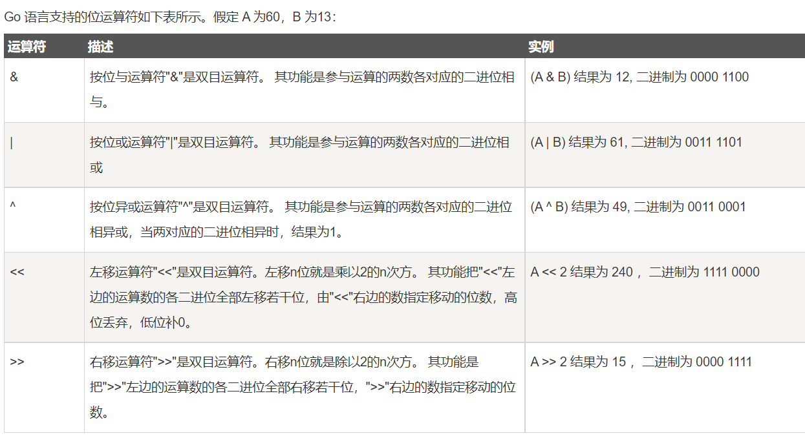

\笔记记录知识点：

#### 1 go中new和make有什么区别？

相同点：两者都是用来创建并分配类型的内存

区别：

1. new只分配内存，
2. make只用来分配slice，map和channel的初始化；new 可以分配任意类型的数据
3. new 分配的空间被清零。make 分配空间后，会进行初始化；
4. new 分配返回的是指针，即类型 *Type。make 返回引用，即 Type；

详细：

1. new返回的是类型的指针，指针指向分配类型的地址。

```go
var s *student
s = new(student)
// student是一个结构体
// s 是一个指针类型的变量
```

2. make只能用于slice、map和channel的内存分配，并且返回类型就是这三个类型本身，因为这三个类型都是引用数据类型。如果使用 new() 分配了一个引用对象，会获得一个空引用的指针，相当于声明了一个未初始化的变量并取了其地址。

```go
1：
a := make([]int,5)
a := make([]int,5,10)
// 5是初始5个，10为容量为[]int预留10个空间
```

#### 2 go中的字符类型可以直接参与运算

golang中的字符使用的是utf-8编码

Unicode是对应的字符集（utf-8是Unicode的一种编码方案）


#### 3 字符串不可变，字符串一旦定义好，就不能通过索引等方式改变，除非重新赋值

```go
x := "text"
// x[0] = 'T'       // error

xtytes := []byte(x) 
xbytes[0] = 'T'     // ok

fmt.Println(string(xbytes)) //prints Text
```

字符串与`[]byte`之间的转换是复制（有内存损耗），可以用map[string] []byte建立字符串与[]byte之间映射，也可range来避免内存分配来提高性能

```go
//[]byte: 
for i,v := range []byte(str) {
}
```

#### 4 数据类型默认值

**Go语言将数据类型分为四类：基础类型、复合类型、引用类型和接口类型**
**基础类型:**

1. 整形
   - 有符号整形 ***int8 int16 int32 int64***默认值 `0`
   - 无符号整形 ***uint8 uint16 uint32 uint64*** 默认值 `0`
   - 特殊整形***int uint byte rune uintptr***默认值 `0`
2. 浮点型
   - 浮点型数 ***float32 float64*** 默认值 `0.0`
   - 复数类型 ***complex64 complex128*** 默认值 `0+0i`
3. 布尔类型 
   - ***true false*** 默认值 `false`
4. 字符串类型 
   - ***string*** 默认值 `""`

**复合类型**

   - 数组类型 `[SIZE]TYPE `默认值根据数组类型变化而变化 

     ```go
     [3]int 为 [0,0,0]
     ```

   - 结构体类型 `struct` 默认值根据随结构体内部类型变化而变化，如下默认值为{0} 即 

```go
type Person struct {
 	Name string
 	Age  int
 }
//Name为""   Age为0
```

**引用类型**

- 指针` *TYPE` 默认值 `nil`
- 切片`[]TYPE `默认值 `nil`
- 字典 `map[TYPE][TYPE]` 默认值`nil`
- 通道 `chan `默认值 `nil`
- **函数 `func `默认值 `nil`**

**接口类型**

- 接口`interface` 默认值`nil`

**这里要特别注意 nil在 Go 中不同类型的 nil 是无法比较的，他们的大小也不一样**

**引用类型中的 slice map chan 要使用 make 函数初始化，如果常规 var NAME TYPE 的方式声明，将不能通过正常的赋值方法来修改默认值**


#### 5 地址与指针

&+变量名 ---》获取地址

**指针变量的声明：**

```go
var ptr *int = &age
// *int 表示这是一个指向int类型的指针类型
// &age 是一个地址，是ptr变量的具体的值，取age这个变量的需要的门牌号
fmt.Println(*ptr)
// 输出的ptr变量存储的数据（该数据是内存中地址号指向的内存空间中的具体数据，也就是age的值）
```


#### 6 函数

1. 函数不支持重载（不支持函数名相同，参数列表不同）

2. 支持可变函数参数：...

   ```go
   func test(args ...int){}//可以传入任意多个int类型的参数
   // 使用
   func test(args ...int){
       for i := 0;i <len(args); i++{
           fmt.Println(args[i])//使用时候可以看成是一个切片
       }
   }
   ```


#### 7 函数的参数变量是值传递，并不改变原值

引用传递：需要传递参数的地址

```go
func test(num *int){
    
}

func main{
    var num int = 10
    test(&num)
}

// 这样可以在test修改num值的情况下，将main中定义的num值也进行修改
```


#### 8 包的导入

1. ```go 
   import "包的路径"
   
   包的路径从：$GOPATH/src后开始计算 
   ```

2. 包的路径要和包名保持一直

3. 一个目录（文件夹下）的包名要一致

4. 给包取别名

   ```go
   import (
   	aaa "fmt"
   )
   aaa.Println("liao"
   ```


#### 9 init函数

​		init函数会在main函数执行前被调用，常作为**初始化**使用

**注：定义全局变量--》init函数--》main函数**

**会优先执行main中引入的包中的init函数**


#### 10 匿名函数:  匿名函数可以被赋值给变量并作为值使用  

1. ```go
   result := func(num1 int, num2 int)int{
       return num1+num2
   }(10,20)
   ```

2. ```go
   result1 := func(num int) int { }
   result1(10,20)
   ```

3. ```go
   func(){
       sum := 0
       for i := 1;i<100;i++{
           sum += i
       }
   }()
   //表示参数列表的第一对括号必须紧挨着关键字 func ， 因为匿名函数没有名称。 花括号 {} 涵盖着函数体， 最后一对括号表示对该匿名函数的调用。
   ```

4. 

#### 11 闭包：

**闭包：返回的匿名函数+匿名函数外的变量（该变量被匿名函数引用）**

**定义：**Go语言中闭包是**引用了自由变量的函数**，被引用的自由变量和函数一同存在，即使已经离开了自由变量的环境也不会被释放或者删除，在闭包中可以继续使用这个自由变量，因此，简单的说**函数 + 引用环境 = 闭包**

```go
// 准备一个字符串
str := "hello world"
// 创建一个匿名函数
foo := func() {
    // 匿名函数中访问str
    str = "hello dude"
}
// 调用匿名函数
foo()
```

- 第 2 行，准备一个字符串用于修改。
- 第 5 行，创建一个匿名函数。
- 第 8 行，在匿名函数中并没有定义 str，str 的定义在匿名函数之前，此时，str 就被引用到了匿名函数中形成了闭包。
- 第 12 行，执行闭包，此时 str 发生修改，变为 hello dude。

**可以在想使用上次产生值的情景下，多次使用闭包来处理。**


#### 12 defer 释放资源

​		defer会在函数执行结束之前的那一坑（return前）执行其后面的语句

​		会先将其后面的代码压入一个**栈（先进后出）**，并且不会拷贝其值。

​		**应用场景：**在程序结束之后，关闭某个使用的资源


#### 13 一个汉字占据三个字节

```go
len("你")//输出3
```


#### 14 错误机制处理 defer+recover

​		panic出现恐慌后，程序被中断，无法继续

​		错误处理：

```go
defer func(){
    err:=recover()
    if err != nil{
        fmt.Println(err)
    }
}()
// 捕获错误之后，不会影响程序的下一步执行
// 优点：提高程序健壮性
```


#### 28 error包

自定义错误：errors.New("出错了")

且不影响程序下一步执行

当想让程序中断时，需使用内置库中的panic函数

```go
err:=errors.New("出错了")
panic(err)
```


#### 29 数组初始化

1. ```go
   var arr [3]int = [3]int{3,6,9}
   ```

2. ```go
   var arr2 = [3]int{1,4,7}
   ```

3. ```go
   var arr3 = [...]int{4,5,6,7}
   ```

4. ```go
   var arr4 = [...]int{1:30, 0:87, 2:88}
   ```

`...`表示数组可变长


#### 30 二维数组的内存

```go
arr[0] --> arr[0][0]
arr[1] --> arr[1][0]
// 地址相同
```


#### 31 切片：建立在数组上，是对数组中连续片段的引用

``` go
// 数组
var intarr [6]int = [6]int{3,6,8,9,4,2}
// 切片
var slice []int = intarr[1:3]
```


切片的索引范围并不是从0开始：`slice[1:3]` 指从索引1到索引4的子切片

`cap(slice) //获取切片的容量`

优点：切片是引用传递不需要使用额外的内存，并且比使用数组更有效率

即：修改切片值，就是在修改实际值


#### 32 位运算（*）



位运算符：

下表列出了所有Go语言的赋值运算符。

| 运算符 | 描述                                           | 实例                                  |
| :----- | :--------------------------------------------- | :------------------------------------ |
| =      | 简单的赋值运算符，将一个表达式的值赋给一个左值 | C = A + B 将 A + B 表达式结果赋值给 C |
| +=     | 相加后再赋值                                   | C += A 等于 C = C + A                 |
| -=     | 相减后再赋值                                   | C -= A 等于 C = C - A                 |
| *=     | 相乘后再赋值                                   | C *= A 等于 C = C * A                 |
| /=     | 相除后再赋值                                   | C /= A 等于 C = C / A                 |
| %=     | 求余后再赋值                                   | C %= A 等于 C = C % A                 |
| <<=    | 左移后赋值                                     | C <<= 2 等于 C = C << 2               |
| >>=    | 右移后赋值                                     | C >>= 2 等于 C = C >> 2               |
| **&=** | **按位与后赋值**                               | **C &= 2 等于 C = C & 2**             |
| ^=     | 按位异或后赋值                                 | C ^= 2 等于 C = C ^ 2                 |
| \|=    | 按位或后赋值                                   | C \|= 2 等于 C = C \| 2               |


#### 33 append在使用的时候需要赋值给一个变量

```go
slice := append(slice, 50, 68)
slice := append(slice, slice2...)
```


#### 34 切片拷贝 copy

```go
newline := make([]int, 10)
// 将slice的值全部赋值给newline
copy(newline, slice)
```


#### 35  存map时候

创建map

```go
// 1
// 声明a是map类型的变量
var a map[int]string
// 为a开辟空间 初始值:0 ""
a = make(map[int]string, 10)

// 2 可以不分配长度
a := make(map[int]string)
// 3 直接赋值
a := map[int]string{
    1:"li",
    2:"ao"
}
```

**(*)当声明map之后，可以直接对map进行赋值，如**

```go
c := make(map[int]bool)
c[3] = true
```

这样就会很方便6

#### 36 操作map

1. 更新和增加

```go
map[key]=value
// 如果有该key则更新，无该key则添加
```

2. 删除

```go
delete(map,"key")
// 如果全部删除的话，需要添加循环然后一个个删除
```

3. 查找

```go
value, bool_leo := map[key]
// 如果有这个value的话，就是返回这个值和true
// 没有这个值的话，就返回空和false
```

4. 遍历：只支持for range操作

```go
for k, v := range map1{
    
}
```

5. map嵌套map需要从新分配空间

```go
a := make(map[string]map[string]int, 3)
a["li"] = make(map[string]int, 1)
a["li"]["ao"] = 520
```


#### 37 结构体

```go
type Shiyan struct{
    name string
    power int
}
// 1 初始化
goku := Shiyan{
    name : "liao"
    power : 100
}
// 2 初始化
goku := Shiyan{}
```

修改结构体中的值 ： **使用指针**

```go
func main(){
    // goku 是Shiyan中的一个对象的地址
    goku := &Shiyan{"liao", 100}
    edit(goku)
}
func edit(p *Shiyan){
    // 直接修改 这个值 *&Shiyan{"liao", 100}
    *p = Shiyan{"lisi", 60}    
}
```

#### 38  go中的函数传递的参数永远都是值传递，不会修改函数中原来的值


#### 39 go的结构体中：对于每种数据类型， 只能有一个匿名字段

结构体匿名字段，即定义结构体时，只写结构体的类型，不写结构体的名字。结构体的匿名字段只能用在结构体类型的嵌套中。

#### 40 关于 new 与 := 在分配结构体空间，其效果其实是一致的

```go
// 使用 new 函数给一个新的结构体变量分配内存， 它返回指向已分配内存的指针： 
var t *T = new(T)
// 如果需要可以把这条语句放在不同的行（ 比如定义是包范围的， 但是分配却没有必要在开始就做） 。
var t *T
t = new(T)
```

使用:= 更简洁 不必使用var 使用*T

```go
// 1
ms := new(struct1)
ms.li = 10
// 2 推荐
ms := &new(struct1){
    10,15.5,"liao"
}
```

#### 41 接口

语法: 接口、结构体、方法实现

```go
/* 定义接口 */
type interface_name interface {
   method_name1 [return_type]
   method_name2 [return_type]
   method_name3 [return_type]
   ...
   method_namen [return_type]
}

/* 定义结构体 */
type struct_name struct {
   /* variables */
}

/* 实现接口方法 */
func (struct_name_variable struct_name) method_name1() [return_type] {
   /* 方法实现 */
}
...
func (struct_name_variable struct_name) method_namen() [return_type] {
   /* 方法实现*/
}
```

实例：

```go
package main

import (
    "fmt"
)

type Phone interface {
    call()
}

type NokiaPhone struct {
}

func (nokiaPhone NokiaPhone) call() {
    fmt.Println("I am Nokia, I can call you!")
}

type IPhone struct {
}

func (iPhone IPhone) call() {
    fmt.Println("I am iPhone, I can call you!")
}

func main() {
    // 定义一个Phone类型的接口变量 phone
    var phone Phone
	// 为 phone 赋值新的对象
    phone = new(NokiaPhone)
    phone.call()

    phone = new(IPhone)
    phone.call()

}
// 输出
I am Nokia, I can call you!
I am iPhone, I can call you!
```


#### 42 并发

以咖啡店为例，两人排两队同时点咖啡，而接到订单一个咖啡师做两杯咖啡，这是并发。

两个咖啡师同时工作，每人做一杯咖啡，这是并行。

同理回到程序中**，多线程程序在单核上运行，就是并发**；**多线程程序在多核上运行，就是并行**。


Go语言的并发不同于Python，基于多线程编程模型，而是采用了基于消息并发模型的方式。它将基于CSP模型的并发编程内置到了语言中，通过一个go关键字就可以轻易地启动一个Goroutine，而且在Goroutine之间是共享内存的。


