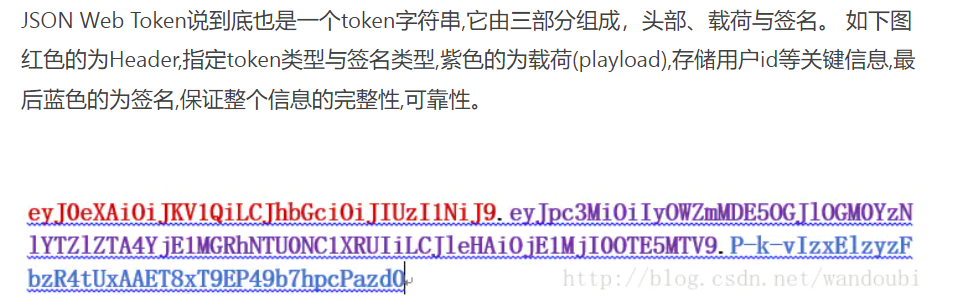
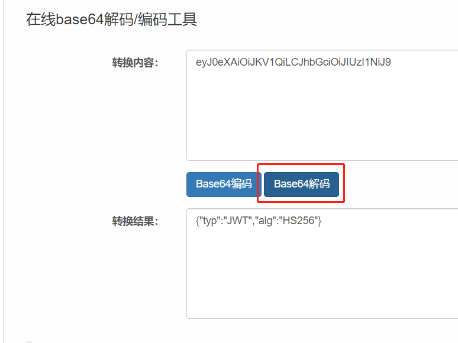
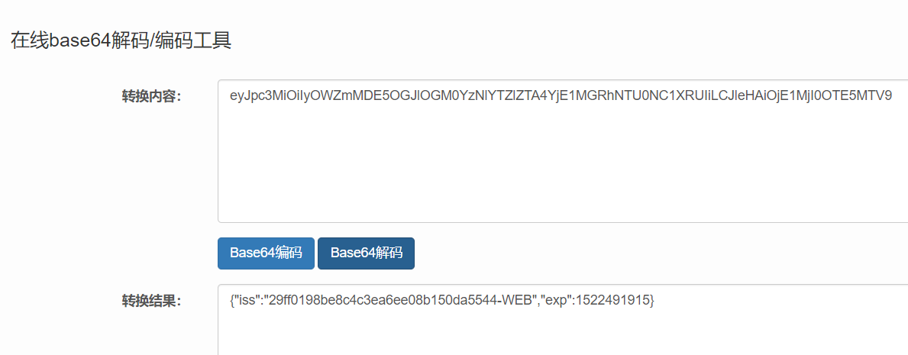
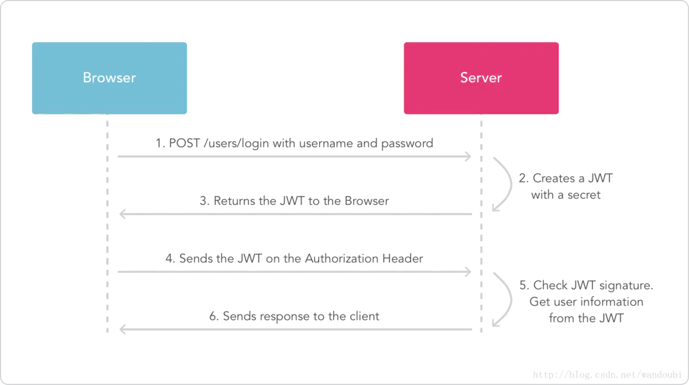

# 1 JWT

JSON Web Token（缩写 JWT）是目前最流行的跨域认证解决方案，本文介绍它的原理，用法和详细的数据结构。

# 2 jwt的结构

jwt说到底就是一个token字符串，由三个部分组成，**头部、载荷与签名**

**头部：**指定jwt的token类型与签名类型

**载荷：**存储用户的id等关键信息

**签名：**保证整个信息的完整性、可靠性




## 2.1 头部

jwt的头部用于描述关于该jwt最基本的信息，其类型以及签名所用的算法等

```json
{
  "typ": "JWT",
  "alg": "HS256"
}
```

在这里，我们说明了这是一个JWT，并且我们所用的签名算法是HS256算法。对它进行Base64编码，之后的字符串就成了JWT的Header（头部）。



## 2.2 载荷

在载荷(playload)中定义了以下属性

```cpp
iss: 该JWT的签发者 
sub: 该JWT所面向的用户 
aud: 接收该JWT的一方 
exp(expires): 什么时候过期，这里是一个Unix时间戳 
iat(issued at): 在什么时候签发的
```

其实也是一个JSON对象进过base64进行编码的



## 2.3 签名

签名是将头部与载荷使用base64进行连接（头部在前，载荷在后），中间使用英文.连接。

最后将拼接成的字符串使用HS256算法进行加密。在加密的时候要提供一个密钥（secret）。那么就可以得到我们加密之后的内容。

## 2.4 签名的目的

最后一步签名的过程，实际上是对头部以及载荷内容进行签名。一般而言，加密算法对于不同的输入产生的输出总是不一样的。
 所以，如果有人对头部以及载荷的内容解码之后进行修改，再进行编码的话，那么新的头部和载荷的签名和之前的签名就将是不一样的。而且，如果不知道服务器加密的时候用的密钥的话，得出来的签名也一定会是不一样的。
 服务器应用在接受到JWT后，会首先对头部和载荷的内容用同一算法再次签名。那么服务器应用是怎么知道我们用的是哪一种算法呢？别忘了，我们在JWT的头部中已经用alg字段指明了我们的加密算法了。
 如果服务器应用对头部和载荷再次以同样方法签名之后发现，自己计算出来的签名和接受到的签名不一样，那么就说明这个Token的内容被别人动过的，我们应该拒绝这个Token，返回一个HTTP 401 Unauthorized响应。



流程如下：

- 客户端使用账户密码请求登录接口
- 登录成功后服务器使用签名密钥生成JWT ，然后返回JWT给客户端。
- 客户端再次向服务端请求其他接口时带上JWT
- 服务端接收到JWT后验证签名的有效性，对客户端做出相应的响应


