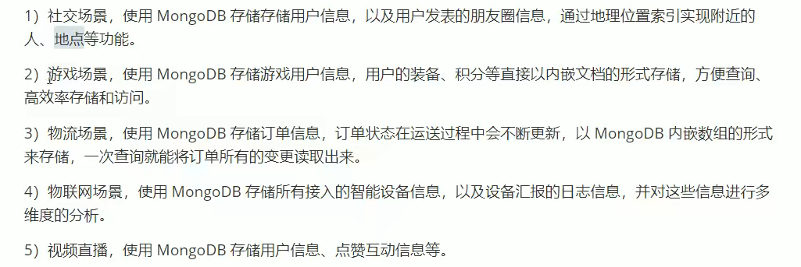
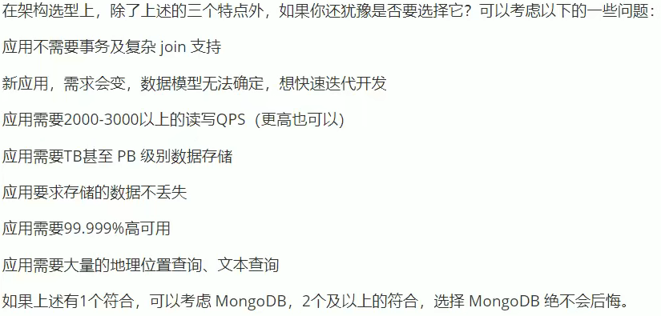
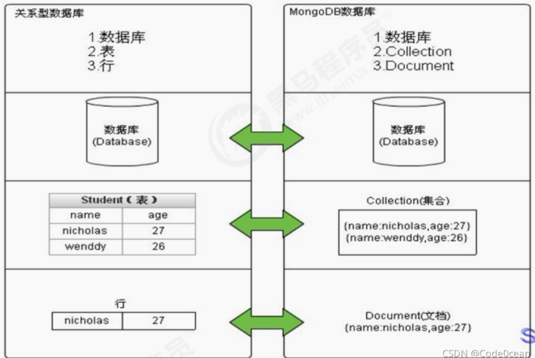
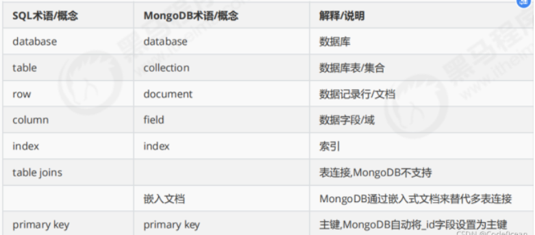
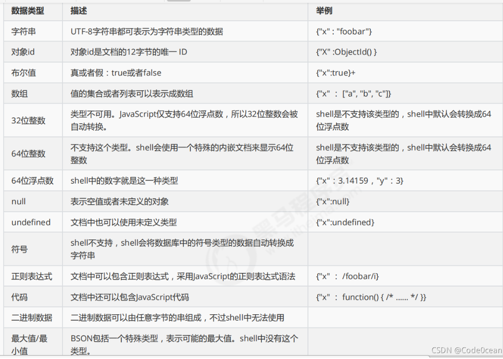
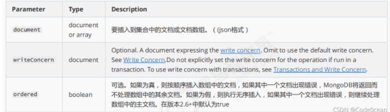

# 1 MongoDB

## 1.1 业务应用场景

传统的关系型数据库，在数据操作的三高需求以及应对现今网站需求面前，力不从心

“三高需求”：

- 对数据库高并发读写的需求

- 对海量数据的高效率存储和访问需求

- 对数据库的高可拓展性和高可用性的需求

**而MongoDB可以应对三高需求**

应用场景：



特点：

 	1. 数据量大
 	2. 写入操作频繁
 	3. 价值较低的数据，对事务性要求不高（MongoDB对事务支持不好v）

**什么时候使用MongoDB？**



实现上述情景下，可以以更低的成本解决上述问题。


## 1.2 MongoDB简介

MongoDB是一个开源的、高性能、无模式的文档型数据库，用于简化开发和方便拓展，是NoSQL数据库的一种，是最像关系型数据库的NoSQL数据库。

它支持的数据结构非常松散，是一种类似于JSON的格式**（BSON）**，既可以存储比较复杂的数据类型，又十分**灵活**。

MongoDB中的记录是一个文档，是一个由字段和键值对组成的数据结构。MongoDB文档类似于JSON对象，即一个文档认为就是一个对象。字段的数据类型是字符型，它的值除了使用基本的一些类型之外，还可以包括其他文档、普通数组和文档数组。

## 1.3 MongoDB体系结构

MySQL与MongoDB之间的对比





## 1.4 数据模型

MongoDB的最小存储单位就是文档对象。文档对象对应于关系型数据库的行。数据在MongoDB中以**BSON文档**的格式存储在磁盘上。

**BSON：**类似json的一种二进制形式的存储格式。支持内嵌的文档对象和数组对象，但是BSON比json的数据类型要丰富的多，如Date和BinData类型。

BSON具有类似C语言结构体的名称、对表示方法，支持内嵌的文档对象和数组对象，具有轻量性、高遍历性、高效性的三个特点。可以有效描述非结构化数据和结构化数据。这种格式的优点是灵活性高，但是它的缺点是空间利用率不是很理想。

**BSON的数据类型：**

1. string,integer,boolean,double,null,array和object**（这些都是基本的JSON数据类型！）**
2. **特殊数据类型：**date,object id,binary data,regular expression 和code



**注意：**

1. shell默认使用64位浮点型数值。`{“x”：3.14}`或``{“x”：3}``。

2. 对于整型值，可以使用NumberInt（4字节符号整数）或NumberLong（8字节符号整数），`{“x”:NumberInt(“3”)}`或者`{“x”:NumberLong(“3”)}`

## 1.5 MongoDB的特点

1. 高性能

- MongoDB提供高性能的数据持久性。特别是，对嵌入型数据模型的支持减少了数据库系统上的I/O活动。
- 索引支持更快的查询，并且可以包含来自嵌入式文档和数组的键。
- mmapv1、wiredtiger、mongorocks（rocksdb）、in-memory 等多引擎支持满足各种场景需求。
- Gridfs解决文件存储的需求。

2. 高可用性

- MongoDB的复制工具称为副本集`（replica set）`，它可提供自动故障转移和数据冗余

3. 高拓展性

- MongoDB提供了水平可拓展性作为其核心功能的一部分。分片将数据分布在一组集群的机器上。**（海量数据存储，服务能力水平扩展）**
- 从3.4开始，MongoDB支持基于片键创建数据区域。在一个平衡的集群中，MongoDB**将一个区域所覆盖的读写只定向到该区域内的那些片。**

4. 丰富的查询支持

- MongoDB支持丰富的查询语言，支持读和写操作(CRUD)，比如数据聚合、文本搜索和地理空间查询等。

5. 无模式

6. 灵活的文档类型


# 2 基本命令

## 2.1 数据库操作

选择和创建数据库的语法格式：

```bash
use 数据库名称
```

如果数据库不存在则自动创建，例如以下创建articledb数据库：

```bash
use articledb
```

查看有权限查看的所有数据库的命令

```bash
show dbs
或
show databases
```

注意: 在` MongoDB `中，**集合**只有在**内容插入后才会创建!** 

就是说，**创建集合(数据表)后要再插入一个文档(记录)，集合才会真正创建**。**数据库同理，只有在插入集合后才会真正创建**

下面三个数据库名是保留的，可以直接访问这些有特殊作用的数据库。

- admin： 从权限的角度来看，这是"root"数据库。要是将一个用户添加到这个数据库，这个用户自动继承所有数据库的权限。一些特定的服务器端命令也只能从这个数据库运行，比如列出所有的数据库或者关闭服务器。
- local: 这个数据永远不会被复制，可以用来存储限于本地单台服务器的任意集合
- config: 当Mongo用于分片设置时，config数据库在内部使用，用于保存分片的相关信息。

查看正在使用的数据库命令

```bash
db
```

MongoDB 删除数据库的语法格式如下：

```bash
db.dropDatabase()#删除当前数据库
```

## 2.2 集合操作

集合，类似关系型数据库中的表，可以显示的创建，也可以隐式的创建。

**集合的显式创建(了解)的基本语法格式：**

```bash
db.createCollection(name)#name：要创建的集合名称

例：创建一个名为 mycollection 的普通集合。
db.createCollection("mycollection")
```

**查看当前库中的表/集合命令：**

```bash
show collections 或
show tables
```

集合的命名规范：

- 集合名不能是空字符串""。
- 集合名不能含有\0字符（空字符)，这个字符表示集合名的结尾。
- 集合名不能以"system."开头，这是为系统集合保留的前缀。
- 用户创建的集合名字不能含有保留字符。有些驱动程序的确支持在集合名里面包含，这是因为某些系统生成的集合中包含该字符。除非你要访问这种系统创建的集合，否则千万不要在名字里出现$。

**集合删除的语法格式如下：**

```bash
db.collection.drop() 
或
db.集合名.drop()
```

如果成功删除选定集合，则 drop() 方法返回 true，否则返回 false。


## 2.3 文档操作

文档（document）的数据结构和 JSON 基本一样。所有存储在集合中的数据都是 BSON 格式。

（1）单个文档插入
使用insert() 或 save() 方法向集合中插入文档，语法如下：

```bash
db.collection.insert(  <document or array of documents>, 
   {
    writeConcern: <document>, 
    ordered: <boolean> 
    } )
```



要向comment的集合中插入一条测试数据：

```bash
db.comment.insert({"articleid":"100000","content":"今天天气真好，阳光明媚","userid":"1001","nickname":"Rose","createdatetime":new Date(),"likenum":NumberInt(10),"state":null})
```


说明：

- comment集合如果不存在，则会隐式创建

- mongo中的数字，默认情况下是double类型，如果要存整型，必须使用函数

- NumberInt(整型数字)，否则取出来就有问题了。

- 插入当前日期使用 new Date()

- 插入的数据没有指定 _id ，会自动生成主键值、

- 如果某字段没值，可以赋值为null，或不写该字段。


执行后结果如下，说明插入一个数据成功了。

```bash
WriteResult({"nInserted":1})
```


**注意：**

1. 文档中的键/值对是有序的。
2. 文档中的值不仅可以是在双引号里面的字符串，还可以是其他几种数据类型（甚至可以是整个嵌入的文档)。
3. MongoDB区分类型和大小写。
4. MongoDB的文档不能有重复的键。
5. 文档的键是字符串。除了少数例外情况，键可以使用任意UTF-8字符。


