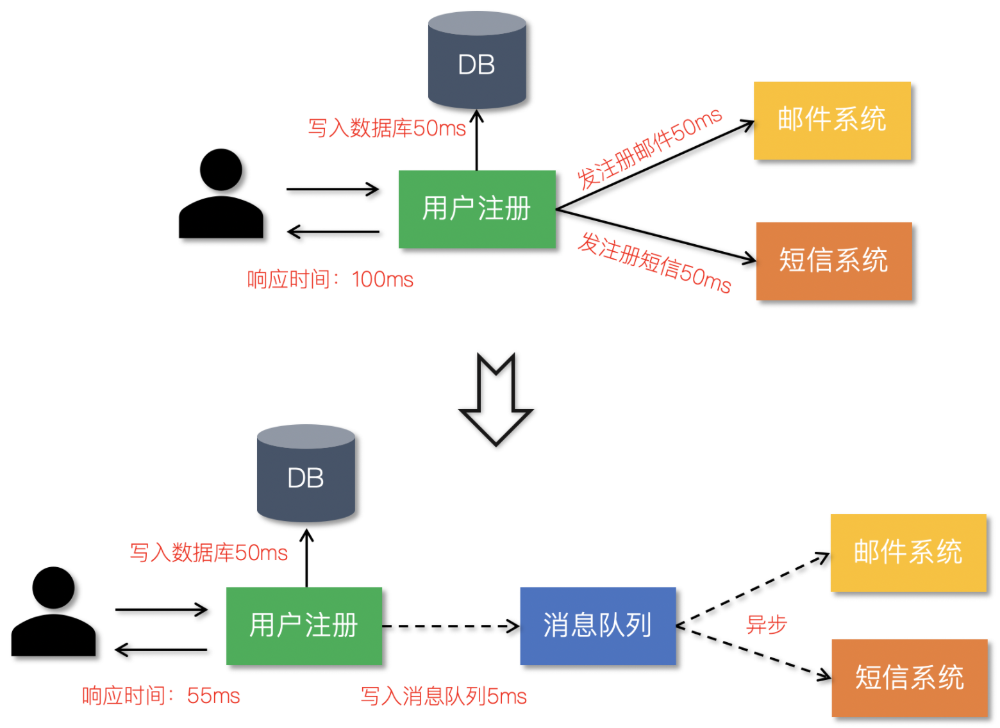
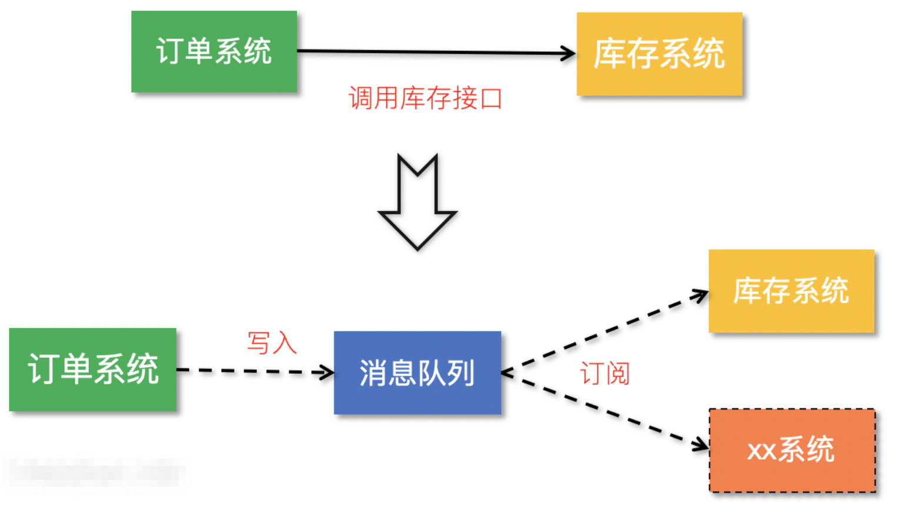
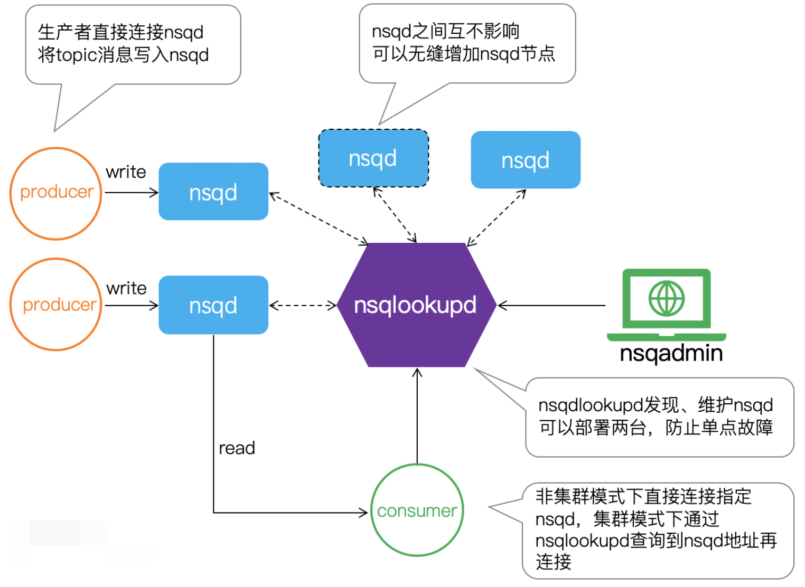

# 1 NSQ

nsq是go语言编写的一个开源的实时分布式的内存消息队列，性能十分优异。

nsq是实时的分布式消息处理平台，其设计的目的是用来大规模地处理每天数以十亿计级别的消息，具有分布式和去中心化的拓扑结构。**该结构具有无单点故障，故障容错，高可用性以及能够保证消息的可靠传递的特征。**

**适用小型项目，用来学习消息队列实现原理，学习golang channel知识，以及如何用go来写分布式。**

缺点：存在很多问题

## 优势：

>1. nsq提倡分布式和分散的拓扑，没有单点故障，支持容错和高可用性，并提供可靠的消息交付保证
>2. 支持横向扩展，没有任何集中式代理
>3. 易于配置和部署，并且内置了管理界面

## 特性：

>1. 支持无spof（单点故障：**是指系统中一点失效，就会让整个系统无法运作的部件**）的分布式拓扑
>2. 水平拓展（没有中间件，就可以无缝的添加更多的节点到集群）
>3. 低延迟的消息传递（性能高）
>4. 结合负载均衡和多播消息路由风格
>5. 擅长面向流媒体（高通量）和工作（低吞吐量）工作负载
>6. 主要是在内存中运行（速度快）
>7. 运行时发现消费者找到生产者服务
>8. 传输层安全性（TLS ）
>9. 数据格式不可知
>10. 容易部署（体现在依赖项的健全）
>11. 集成了statsd（用于实时监测）
>12. 健壮的集群管理界面nsqadmin
>13. http接口统计，管理行为和生产者

##注意：

>1. 消息默认不持久化，可以配置成持久化，
>
>  ​	采用的是内存+硬盘模式，如果内存占满了，那么就会持久化到硬盘
>
>2. 每条消息至少传递一次
>
>2.    **消息不保证有序**
>


# 2 NSQ应用场景



## 2.1 应用解耦

通过消息队列将不同业务逻辑解耦，降低系统间耦合，提高系统的健壮性，后续有其他的业务要使用订单数据可直接订阅消息队列，提高系统的灵活性。



## 2.2 流量削峰

类似秒杀（大秒）等场景下，某一时间可能会产生大量的请求，使用消息队列能够为后端处理请求提供一定的缓冲区，保证后端服务的稳定性。


# 3 NSQ架构

## 3.1 nsq模块

### 1 nsqd

nsqd是一个进程，监听两种协议，用来创建topic和channel，并分发消息给消费者，向nsqlooup注册自己的元数据信息（topic、channel、consumer），自己的服务信息，最核心模块

> nsqd 是一个守护进程，负责接收，排队，投递消息给客户端。也就是说这个服务是干活的。它可以独立运行，不过通常它是由 nsqlookupd 实例所在集群配置的。

```go
// 特性：
1. 对订阅了同一个topic，同一个channel的消费者使用负载均衡策略（不是轮询）
	//一般是随机的分配资源剩余的nsqd
2. 只要channel存在，即使没有该channel的消费者，也会将生产者的message缓存到队列中。（注意消息的过期处理）
	
3. 保证队列中的message至少会被消费一次，即使nsqd退出，也会将队列中的消息暂存到磁盘上（结束进程等意外情况除外）

4. 限定内存占用，能够配置nsqd中每个channel队列在内存中缓存的message数量，一旦超过，message将被缓存到磁盘中。

5. topic，channel一旦建立，将会一直存在，要及时在管理台或者用代码清除无效的topic和channel，避免资源浪费

```

### 2 nsqlookup

存储了nsqd的元数据和服务信息(endpoind)，向消费者提供服务发现**(就是帮助他找到合适的nsqd节点)**功能， 向nsqadmin提供数据查询功能。

> nsqlookupd 是守护进程负责管理拓扑信息。客户端通过查询 nsqlookupd 来发现指定话题（topic）的生产者，并且 nsqd 节点广播话题（topic）和通道（channel）信息。也就是说nsqlookupd是管理者。

```go
/*
特性:
	1. 唯一性，在一个Nsq服务中只有一个nsqlookupd服务。当然也可以在集群中部署多个nsqlookupd，但它们之间是没有关联的.
	2. 去中心化，即使nsqlookupd崩溃，也会不影响正在运行的nsqd服务
	3. 充当nsqd和naqadmin信息交互的中间件
	4. 提供一个http查询服务，给客户端定时更新nsqd的地址目录.
*/
```

### 3 nsqadmin

简单的管理界面，展示topic，channel以及channel上的消费者，也可以在上面创建topic和channel

```go
/*
特性:
	1. 提供一个对topic和channel统一管理的操作界面以及各种实时监控数据的展示，界面设计的很简洁，操作也很简单
	2. 展示所有message的数量
	3. 能够在后台创建topic和channel
	4. nsqadmin的所有功能都必须依赖于nsqlookupd，nsqadmin只是向nsqlookupd传递用户操作并展示来自nsqlookupd的数据
		
*/
```


# 4 NSQ工作模式





# 5 topic和channel 

> 每个nsqd实例旨在一次处理多个数据流。这些数据流称为`“topics”`，一个`topic`具有1个或多个`“channels”`。每个`channel`都会收到`topic`所有消息的副本，实际上下游的服务是通过对应的`channel`来消费`topic`消息。
>
> `topic`和`channel`不是预先配置的。`topic`在首次使用时创建，方法是将其发布到指定`topic`，或者订阅指定`topic`上的`channel`。`channel`是通过订阅指定的`channel`在第一次使用时创建的。
>
> `topic`和`channel`都相互独立地缓冲数据，防止缓慢的消费者导致其他`chennel`的积压（同样适用于`topic`级别）。
>
> `channel`可以并且通常会连接多个客户端。假设所有连接的客户端都处于准备接收消息的状态，则每条消息将被传递到随机客户端。例如：


```go
生产者向某个topic中发送消息，如果topic有一个或者多个channle，那么该消息会被复制多分发送到每一个channel中。类似 rabbitmq中的fanout类型，channle类似队列。 
```
```go
官方说 nsq 是分布式的消息队列服务，但是在我看来只有channel到消费者这部分提现出来分布式的感觉，nsqd 这个模块其实就是单点的，nsqd 将 topic、channel、以及消息都存储在了本地磁盘，官方还建议一个生产者使用一个 nsqd，这样不仅浪费资源还没有数据备份的保障。一旦 nsqd 所在的主机磁损坏，数据都将丢失。
````
```go
总而言之,消息是从topic--> channel (每个channel接受该topic的所有消息的副本)多播的,但是从channel --> consumers均匀分布 (每个消费者接受该channel的一部分消息)
```


# 6 Go操作NSQ

**生产者：**

```go
// nsq_producer/main.go
package main

import (
	"bufio"
	"fmt"
	"os"
	"strings"

	"github.com/nsqio/go-nsq"
)

// NSQ Producer Demo

var producer *nsq.Producer

// 初始化生产者
func initProducer(str string) (err error) {
	config := nsq.NewConfig()
	producer, err = nsq.NewProducer(str, config)
	if err != nil {
		fmt.Printf("create producer failed, err:%v\n", err)
		return err
	}
	return nil
}

func main() {
	nsqAddress := "192.168.43.47:4150"
	err := initProducer(nsqAddress)
	if err != nil {
		fmt.Printf("init producer failed, err:%v\n", err)
		return
	}

	reader := bufio.NewReader(os.Stdin) // 从标准输入读取
	for {
        // 检测回车然后退出
		data, err := reader.ReadString('\n')
		if err != nil {
			fmt.Printf("read string from stdin failed, err:%v\n", err)
			continue
		}
        // strings.TrimSpace会返回一个string类型的slice，并将最前面和最后面的ASCII定义的空格去掉，中间的空格不会去掉，如果遇到了\0等其他字符会认为是非空格
		data = strings.TrimSpace(data)
		if strings.ToUpper(data) == "Q" { // 输入Q退出
			break
		}
		// 向 'topic_demo' 发布数据
		err = producer.Publish("topic_demo", []byte(data))
		if err != nil {
			fmt.Printf("publish msg to nsq failed, err:%v\n", err)
			continue
		}
	}
}
```


**消费者：**

```go
// nsq_consumer/main.go
package main

import (
	"fmt"
	"os"
	"os/signal"
	"syscall"
	"time"

	"github.com/nsqio/go-nsq"
)

// NSQ Consumer Demo

// MyHandler 是一个消费者类型
type MyHandler struct {
	Title string
}

// HandleMessage 是需要实现的处理消息的方法
func (m *MyHandler) HandleMessage(msg *nsq.Message) (err error) {
	fmt.Printf("%s recv from %v, msg:%v\n", m.Title, msg.NSQDAddress, string(msg.Body))
	return
}

// 初始化消费者
func initConsumer(topic string, channel string, address string) (err error) {
	config := nsq.NewConfig()
	config.LookupdPollInterval = 15 * time.Second
	c, err := nsq.NewConsumer(topic, channel, config)
	if err != nil {
		fmt.Printf("create consumer failed, err:%v\n", err)
		return
	}
	consumer := &MyHandler{
		Title: "沙河1号",
	}
	c.AddHandler(consumer)

	// if err := c.ConnectToNSQD(address); err != nil { // 直接连NSQD
	if err := c.ConnectToNSQLookupd(address); err != nil { // 通过lookupd查询
		return err
	}
	return nil

}

func main() {
	err := initConsumer("topic_demo", "first", "192.168.43.47:4161")
	if err != nil {
		fmt.Printf("init consumer failed, err:%v\n", err)
		return
	}
	c := make(chan os.Signal)        // 定义一个信号的通道
	signal.Notify(c, syscall.SIGINT) // 转发键盘中断信号到c
	<-c                              // 阻塞
}

```


