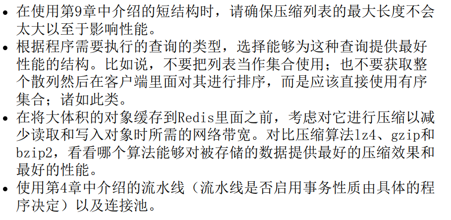

# 1 Redis入门

## 1.1初识Redis（Remote Dictionary Server）

1、是一个速度非常快的非关系型数据库，提供5种不同的类型的数据结构，可以将内存中的键值对，数据持久化到硬盘，可以使用复制特性来拓展读性能。在客户端分片来拓展写性能。

### 1.1.1 Redis 与其他数据库与软件的对比

​		Redis不使用表，他的数据库也不会强制要求使用者对Redis存储的不同数据进行关联

​		Redis可以两种不同的方式将数据写入硬盘，可以存储5种不同的数据结构，可以解决更广泛的问题，

​		**Redis具有以下5种数据结构：**

1. string（字符串）：可以是字符串、整数、浮点数

2. list（列表）：一个链表，每个表节点包含了一个字符串

3. set（集合）：包含字符串的无序收集器，每个字符串都是各不相同的元素

4. hash（散列）：包含键值对的无序散列表

5. zset（有序集合）：字符串成员与浮点数分值的有序映射，（按照分值的大小排序）

**Redis还有三种特殊数据类型：**三种特殊的数据类型，分别是 **HyperLogLogs**（基数统计）， **Bitmaps** (位图) 和 **geospatial** （地理位置）

1.  **基数统计：**可以非常省内存的统计各种计数，比如 注册IP数目等等


   

## 1.2 Redis数据结构简介

### 1.2.1 Redis中的字符串

​		Redis中的字符串仍然是依照，键值对进行存储的，包含**键名，值类型，值**。三个部分		

​		**命令：**

1. **GET：** 获取存储的给定键名中的值

2. **SET：** 设置存储在给定键名的值

3. **DEL：** 删除存储在给定键名的值

使用``` redis -cli```启动Redis客户端

```shell
redis-cli
set hello world
OK
get hello
world
del hello
(integer)1
get hello 
(nil)
```

### 1.2.2 Redis中的列表

​		**链表（linked-list）独树一帜。**


​		**一个列表结构可以有效的存储多个字符串（注不是键名而是字符串）**，而一个字符串值操作一个，**值得注意的是列表中是可以出现相同元素的**

**命令：**

|  命令  | 行为                                     |
| :----: | :--------------------------------------- |
| rpush  | 将给定值推入列表的右端                   |
| lrange | 获取列表在给定范围的所有值               |
| lindex | 获取列表在给定位置上的单个元素           |
|  lpop  | 从列表的左端弹出一个值，并返回被弹出的值 |

```shell
rpush list-key item 会返回当前列表的长度
(integer)1 

rpush list-key item2 
(integer)2

rpush list-key item
(integer)3

lrange list-key 0 -1 获取列表中的全部元素
1)"item"
2)"item2"
3)"item"

lindex list-key 1
"item2"

lpop list-key
"item"

lrange list-key 0 -1
1)"item2"
2)"item"
```

### 1.2.3 Redis中的集合


​		集合与列表一样都可以存储多个字符串，但是集合通过使用散列表来保证存储的每个字符串都是各不相同的（无序）

|    命令    | 行为                                       |
| :--------: | :----------------------------------------- |
|    sadd    | 将给定元素添加到现有集合                   |
|  smembers  | 返回集合中包含的全部元素                   |
| sismembers | 检查给定元素是否存在于集合中               |
|    sram    | 如果给定元素存在于集合中，那么移除这个元素 |

```shell
sadd set-key item
(integer)1  1代表成功添加，0代表添加失败

```


### 1.2.4 Redis的散列

​		Redis的散列可以存储多个 键值对之间的映射。和字符串一样，散列存储的值，可以是字符串也可以是数字。


| 命令    | 行为                                           |
| ------- | ---------------------------------------------- |
| hset    | 在散列里面关联起给定的键值对                   |
| hget    | 获取指定散列键的值                             |
| hgetall | 获取散列中包含的全部键值对                     |
| hdel    | 如果给定的键存在于这个散列里面，那么移除这键值 |


### 1.2.5 Redis的有序集合

​		有序集合与散列都是用来存储键值对的，有序集合的键被称为成员，每个成员的名字都是**不相同的**。有序集合里面的值被称为分值**（分值必须为浮点数）**。

​		有序集合是Redis里面唯一个即可根据成员访问元素，又可以根据分值以及分值的排列顺序访问元素的结构。


| 命令          | 行为                                                     |
| ------------- | -------------------------------------------------------- |
| zadd          | 将一个 带有给定分值的成员添加到有序集合里面              |
| zrange        | 根据元素在有序排列中所处的位置，从有序集合中获取多个元素 |
| zrangebyscore | 获取有序集合在给定分值范围内的所有元素                   |
| zrem          | 如果给定成员存在于有序集合，那么移除这个成员             |

### 1.2.6 HyperLogLogs（基数统计）

- **什么是基数？**

举个例子，A = {1, 2, 3, 4, 5}， B = {3, 5, 6, 7, 9}；

那么基数（不重复的元素）= 1, 2, 4, 6, 7, 9； （允许容错，即可以接受一定误差）

- **HyperLogLogs 基数统计用来解决什么问题**？

这个结构可以非常省内存的去统计各种计数，比如注册 IP 数、每日访问 IP 数、页面实时UV、在线用户数，共同好友数等。

- **它的优势体现在哪**？

一个大型的网站，每天 IP 比如有 100 万，粗算一个 IP 消耗 15 字节，那么 100 万个 IP 就是 15M。而 HyperLogLog 在 Redis 中每个键占用的内容都是 12K，理论存储近似接近 2^64 个值，不管存储的内容是什么，它一个基于基数估算的算法，只能比较准确的估算出基数，可以使用少量固定的内存去存储并识别集合中的唯一元素。而且这个估算的基数并不一定准确，是一个带有 0.81% 标准错误的近似值（对于可以接受一定容错的业务场景，比如IP数统计，UV等，是可以忽略不计的）

- **相关命令使用**

```bash
127.0.0.1:6379> pfadd key1 a b c d e f g h i	# 创建第一组元素
(integer) 1
127.0.0.1:6379> pfcount key1					# 统计元素的基数数量
(integer) 9
127.0.0.1:6379> pfadd key2 c j k l m e g a		# 创建第二组元素
(integer) 1
127.0.0.1:6379> pfcount key2
(integer) 8
127.0.0.1:6379> pfmerge key3 key1 key2			# 合并两组：key1 key2 -> key3 并集
OK
127.0.0.1:6379> pfcount key3
(integer) 13
```


### 1.2.7 Bitmap （位存储）

> Bitmap 即位图数据结构，都是操作二进制位来进行记录，只有0 和 1 两个状态。

- **用来解决什么问题**？

比如：统计用户信息，活跃，不活跃！ 登录，未登录！ 打卡，不打卡！ **两个状态的，都可以使用 Bitmaps**！

如果存储一年的打卡状态需要多少内存呢？ 365 天 = 365 bit 1字节 = 8bit 46 个字节左右！

- **相关命令使用**

使用bitmap 来记录 周一到周日的打卡！ 周一：1 周二：0 周三：0 周四：1 ......

```bash
127.0.0.1:6379> setbit sign 0 1
(integer) 0
127.0.0.1:6379> setbit sign 1 1
(integer) 0
127.0.0.1:6379> setbit sign 2 0
(integer) 0
127.0.0.1:6379> setbit sign 3 1
(integer) 0
127.0.0.1:6379> setbit sign 4 0
(integer) 0
127.0.0.1:6379> setbit sign 5 0
(integer) 0
127.0.0.1:6379> setbit sign 6 1
(integer) 0
```

统计操作，统计 打卡的天数！

```bash
127.0.0.1:6379> bitcount sign # 统计这周的打卡记录，就可以看到是否有全勤！
(integer) 3
```

### 1.2.8 geospatial (地理位置)

**geo底层的实现原理实际上就是Zset, 我们可以通过Zset命令来操作geo**

```bash
127.0.0.1:6379> type china:city
zset
```

查看全部元素 删除指定的元素

```bash
127.0.0.1:6379> zrange china:city 0 -1 withscores
 1) "xian"
 2) "4040115445396757"
 3) "hangzhou"
 4) "4054133997236782"
 5) "manjing"
 6) "4066006694128997"
 7) "taiyuan"
 8) "4068216047500484"
 9) "shenyang"
1)  "4072519231994779"
2)  "shengzhen"
3)  "4154606886655324"
127.0.0.1:6379> zrem china:city manjing
(integer) 1
127.0.0.1:6379> zrange china:city 0 -1
1) "xian"
2) "hangzhou"
3) "taiyuan"
4) "shenyang"
5) "shengzhen"
```

#### 1 geoadd

| 命令   | 描述         |格式|
| ------ | ------------ |--|
| geoadd | 添加地理位置,该命令以采用标准格式的参数x,y,所以经度必须在纬度之前 | GEOADD Sicily 13.361389 38.115556 "Palermo" 15.087269 37.502669 "Catania" |

```bash
127.0.0.1:6379> geoadd china:city 118.76 32.04 manjing 112.55 37.86 taiyuan 123.43 41.80 shenyang
(integer) 3
127.0.0.1:6379> geoadd china:city 144.05 22.52 shengzhen 120.16 30.24 hangzhou 108.96 34.26 xian
(integer) 3
复制代码
```

**规则**

两级无法直接添加，我们一般会下载城市数据(这个网址可以查询 GEO：

- 有效的经度从-180度到180度。
- 有效的纬度从-85.05112878度到85.05112878度。

```bash
# 当坐标位置超出上述指定范围时，该命令将会返回一个错误。
127.0.0.1:6379> geoadd china:city 39.90 116.40 beijin
(error) ERR invalid longitude,latitude pair 39.900000,116.400000
```

#### 2 geopos


| 命令   | 描述                       | 格式                                      |
| ------ | -------------------------- | ----------------------------------------- |
| geopos | 获取指定的成员的经度和纬度 | GEOPOS Sicily Palermo Catania NonExisting |

- **返回值：**

  GEOPOS 命令返回一个数组， 数组中的每个项都由两个元素组成： 第一个元素为给定位置元素的经度， 而第二个元素则为给定位置元素的纬度。

  当给定的位置元素不存在时， 对应的数组项为空值。

> 获取指定的成员的经度和纬度

```bash
127.0.0.1:6379> geopos china:city taiyuan manjing
1) 1) "112.54999905824661255"
   1) "37.86000073876942196"
2) 1) "118.75999957323074341"
   1) "32.03999960287850968"
```


#### 3 geodist


| 命令    | 描述                                                         | 格式                           |
| ------- | ------------------------------------------------------------ | ------------------------------ |
| geodist | 返回两个给定位置之间的距离。如果两个位置之间的其中一个不存在， 那么命令返回空值。 | GEODIST Sicily Palermo Catania |

- **返回值：**

  计算出的距离会以双精度浮点数的形式被返回。 如果给定的位置元素不存在， 那么命令返回空值。

单位如下：m、km、mi（英里）、ft（英尺）

```bash
127.0.0.1:6379> geodist china:city taiyuan shenyang m
"1026439.1070"
127.0.0.1:6379> geodist china:city taiyuan shenyang km
"1026.4391"
```


#### 4 georadius

| 命令      | 描述                                                         | 格式                                                         |
| --------- | ------------------------------------------------------------ | ------------------------------------------------------------ |
| georadius | 以给定的经纬度为中心， 返回键包含的位置元素当中， 与中心的距离不超过给定最大距离的所有位置元素。 | 参数 key 经度 纬度 半径 单位 [显示结果的经度和纬度] [显示结果的距离] [显示的结果的数量] |

范围可以使用以下其中一个单位：

- **m** 表示单位为米。
- **km** 表示单位为千米。
- **mi** 表示单位为英里。
- **ft** 表示单位为英尺。

在给定以下可选项时， 命令会返回额外的信息：

- `WITHDIST`: 在返回位置元素的同时， 将**位置元素与中心之间的距离**也一并返回。 距离的单位和用户给定的范围单位保持一致。
- `WITHCOORD`: 将**位置元素的经度和维度**也一并返回。
- `WITHHASH`: 以 52 位有符号整数的形式， 返回位置元素经过**原始 geohash 编码**的**有序集合分值**。 这个选项主要用于底层应用或者调试， 实际中的作用并不大。

命令默认返回未排序的位置元素。 通过以下两个参数， 用户可以指定被返回位置元素的排序方式：

- `ASC`: 根据中心的位置， 按照从近到远的方式返回位置元素。
- `DESC`: 根据中心的位置， 按照从远到近的方式返回位置元素。

在默认情况下， GEORADIUS 命令会返回所有匹配的位置元素。 虽然用户可以使用 **COUNT `<count>`** 选项去获取前 N 个匹配元素， 但是因为命令在内部可能会需要对所有被匹配的元素进行处理， 所以在对一个非常大的区域进行搜索时， 即使只使用 `COUNT` 选项去获取少量元素， 命令的执行速度也可能会非常慢。 但是从另一方面来说， 使用 `COUNT` 选项去减少需要返回的元素数量， 对于减少带宽来说仍然是非常有用的。


#### 5 georadiusbymember

| 命令              | 描述                                   | 格式 |
| ----------------- | -------------------------------------- | ---- |
| georadiusbymember | 显示与指定成员一定半径范围内的其他成员 |      |

```bash
redis> GEOADD Sicily 13.583333 37.316667 "Agrigento"
(integer) 1
redis> GEOADD Sicily 13.361389 38.115556 "Palermo" 15.087269 37.502669 "Catania"
(integer) 2
redis> GEORADIUSBYMEMBER Sicily Agrigento 100 km
1) "Agrigento"
2) "Palermo"
redis> 
```

**参数与 georadius 一样**


#### 6 geohash

| 命令    | 描述                           | 格式 |
| ------- | ------------------------------ | ---- |
| geohash | 该命令返回11个字符的hash字符串 |      |

- **返回值**

  一个数组， 数组的每个项都是一个 geohash 。 命令返回的 geohash 的位置与用户给定的位置元素的位置一一对应。

```bash
redis> GEOADD Sicily 13.361389 38.115556 "Palermo" 15.087269 37.502669 "Catania"
(integer) 2
redis> GEOHASH Sicily Palermo Catania
1) "sqc8b49rny0"
2) "sqdtr74hyu0"
redis> 
```

**将二维的经纬度转换为一维的字符串, 如果两个字符串越接近, 则距离越近**


## 1.3 投票网站

使用redis存储网站上的各种信息，使用一个散列存储文章的标题、网址、发布作者、文章的发布时间文章的投票数量等。

​		

​		


​		上面两个有序集合分别记录了根据发布时间排序的文章和根据评分排序的文章


# 2 使用Redis构建Web应用

​		web应用是用过HTTP协议对网页浏览器发送的请求进行响应的服务器或者服务（service）。一个Web服务器对请求进行响应的典型步骤如下。

1. 服务器对客户端发来的请求（request）进行解析。
2. 请求（request）被转发给一个预定义的处理器（handler）
3. 处理器（handler）可能会从数据库中取出数据
4. 处理器（handler）根据取出的数据对模板（template）进行渲染（render）
5. 处理器（handler）向客户端返回渲染后的内容作为请求的响应（response）

## 2.1 Redis管理用户登录会话（session）

​		通常在登录互联网时会使用cookie记录我们的身份，而被登录的网站会存储这些cookie，并在每次发送请求的同时将cookie返回给服务。

​		对于用来登录的cookie来说，将登录信息存储在cookie里面：

1. 签名（signed）

​	存储用户名、用户ID、最后一次成功登录的时间以及其他可能感觉有用的信息。除此之外，还包含一个签名（signed），服务器使用这个签名来验证浏览器发送的信息是否经过改动。（将cookie中的登录用户名改成另外一个）

2. 令牌（token）

​	会存储一串随机的字节作为令牌，服务器可以根据令牌在数据库中查找令牌的拥有者。


​		传统：用户在浏览页面的过程中，浏览器会记录用户浏览过的所有商品以及用户最后一次访问页面的时间等信息。这样会导致大量的数据库写入，大多数的关系型数据库在每秒只能插入、更新或者删除200-2000个数据库行（大多是对行（记录）操作的）。

​		提出使用redis重新实现登录cookie功能取代现有的关系型数据库实现的cookie功能。

### 2.1.1 步骤1

​		首先使用一个散列（可能是最常用的redis结构）来存储登录cookie令牌与已登录的用户之间的映射。使用这个散列表A，可根据给定的令牌查找与之对应的用户，在用户已经登录的情况下，返回用户的ID。（注：查找令牌并不困难，但是在更新令牌的时候需要注意）

**更新令牌：**每次在用户浏览页面的时候，程序会更新在散列表A中用户的登录信息，并将用户的令牌与当前时间戳添加到有序集合A中（用于记录最近登录用户）。

如果用户在浏览一个商品页面，那么程序会将商品信息添加到有序集合B中（用于记录最近浏览过的商品的），如果B中记录的商品数量超过一定数目，对B中的数据进行修剪。

**伪代码**：记录用户最后一次浏览商品的时间以及用户最近浏览了哪些商品。


注：redis是占用内存进行执行的，但是一直存储会话数据，占用的内存会越来越大，故需要定期清理旧的数据。

**清理会话：**

​		定期检查存储**最近登录令牌**的有序集合A的大小，如果大小超过一定限制，就会执行清除最旧的100个令牌。

​		并从散列A中删除被移除令牌对应的用户信息。

​	

## 2.2 使用Redis实现购物车

​		**使用cookie实现购物车：**将整个购物车存储到cookie

​		**优点：**无需对数据库进行写入操作。

​		**缺点：**

1. 程序需要重新解析和验证cookie，用于确保信息正确。 
2. 每次浏览器发送请求都会发送cookie，所以如果购物车cookie体积较大，会影响速度		

**使用Redis实现购物车：**将购物车信息存储到redis中，并且使用与用户会话cookie相同的cookie ID来使用购物车。

**步骤：**

​		一个购物车是一个散列表（存储了商品ID与商品订购数量之间的映射）。

​		将具体的信息验证工作交给了web程序。

**需求：**

​		如果，用户订购某件商品的数量>0:

​				那么，程序将这件商品的ID与订购数量添加到散列里面。

​				如果，用户购买的商品已经存在于散列中:

​						那么，新的订购数量会覆盖已有的订购数量

​		如果，用户订购某件商品的数量<0：

​				那么程序将从散列表中移除这个条目。

​				移除后还需要对之前的会话清理函数进行更新，在清理旧会话的同时，将与旧会话对应用户的购物车也一并删除。


**好处：**这种做法可以减少请求的体积，还可以对用户行为进行统计计算（数据分析）。


## 2.3 网页缓存

 		在动态生成网页，可以使用模板语言来简化网页的生成操作。**（不需要手写页面了）**

​		**目的：**减少渲染相同网页结构的消耗。

​		**手段：**在处理请求之前或者之后添加层**（中间件）**，在中间件上调用redis缓存函数。

​		**伪代码：**

​		如果，请求不能被缓存：

​				函数直接生成并返回页面

​		如果，请求可以被缓存：

​						如果，缓存页面存在：

​								函数从缓存里面取出并返回被缓存的页面。

​						如果，缓存页面不存在：

​								函数生成页面并缓存在redis里面5分钟。最后将页面返回给函数的调用者。		


## 2.4 数据行缓存

​		**问题：**网页只会从数据库里面加载一两行数据。

​		**目的：**应对促销活动带来的大量负载，需要对数据行进行缓存。

​		**手段：**编写一个持续运行的守护进程函数，让这个函数将指定的数据行缓存到redis中，并不定期的对这些数据行缓存进行更新。

​		**具体：**缓存函数将数据行编码为JSON字典并存储在redis的字符串中。**（列名会被映射为JSON字典中的键名；数据行所对应的值会被映射为JSON字典的值）**


**更新数据行缓存：**使用两个有序集合

1. **调度有序集合：**

   成员：数据行的行ID

   分值：时间戳**（记录在何时将指定的数据行缓存到Redis里面）**

2. **延时有序集合：**

   成员：数据行的行ID

   分值：一个时间数**（延迟值：记录指定数据行的缓存，应该多少秒更新一次）**


**对数据行进行缓存：**

函数A**（负责缓存数据行的函数）**，读取调度有序集合的第一个元素以及其分值。如果有序集合中没有元素，或者没有到达分值所在的时间戳，那么函数先休眠一段时间，休眠后再继续检查。当缓存函数发现一个需要立即更新的数据行时，会检查检查延时有序集合里面该集合的延迟值。

​		如果延迟值小于等于0，那么缓存函数在两个有序集合中这个数据行的ID，并删除缓存中的该数据行的缓存，然后从新检查。

​		如果延迟值大于0，会从数据库取出这些行，并编码为JSON格式，存储在redis中，更新这些行的调度时间。


## 2.5 网页分析

如何只缓存一部分页面来减少实现页面缓存所需的内存数量。

**手段：**根据浏览次数对商品进行排序，被浏览得最多一个的商品将被放到有序集合的索引0位置上，分值将是整个有序集合中最小的。

最终只


# 3 Redis命令

## 3.1 字符串

字符串可以存储3种类型的值：**字符串（byte string）、整数、浮点数**

| 命令        | 用例                           | 描述                             |
| ----------- | ------------------------------ | -------------------------------- |
| incr        | incr keyname                   | 将键存储的值加上整数1            |
| decr        | decr keyname                   | 将键存储的值减少整数1            |
| incrby      | incrby keyname count           | 将键存储的值加上整数count        |
| decrby      | decrby keyname count           | 将键存储的值减少整数count        |
| incrbyfloat | incrbyfloat keyname floatValue | 将键存储的值加上浮点数floatValue |

**注：如果用户对一个不存在的键或者一个保存了空串的键，执行自增或者自减操作，那么redis会将这个键的值当做是0处理。**

**注：如果存在一个值不是整数也不是浮点数的字符串，那么会返回一个error**


**处理子串和二进制位：**

| 命令     | 用例                          | 描述                                                         |
| -------- | ----------------------------- | ------------------------------------------------------------ |
| append   | append keyname value          | 将值value追加到给定键的值的末尾 |
| getrange | getrange keyname start end    | 获取一个由偏移量start至偏移量end范围内所有字符串组成的子串，包括start和end |
| setrange | setrange keyname offset value |  |


## 3.2 列表

列表允许用户从两端推入或者弹出元素，以及进行各种常见操作。https://www.runoob.com/redis/redis-lists.html

| 命令  | 描述                                                         | 用例                                                         |
| ----- | ------------------------------------------------------------ | ------------------------------------------------------------ |
| rpush | 将一个或者多个值推入列表右端                                 |  |
| Blpop | 移除并获取列表中的第一个元素， 如果列表没有元素会阻塞列表直到等待超时或发现可弹出元素为止        **如果列表为空，返回一个nil。否则返回一个含有两个元素的列表，第一个元素是被弹出元素的key，第二个是被移除元素的值** | BLPOP LIST1 LIST2 .. LISTN TIMEOUT                           |
| lpop  | 移出并获取列表的第一个元素                                   |  |
| llen  | 获取列表长度                                                 | llen keyname                                                 |


## 3.3 集合

​		redis中的集合以无序的方式存储多个各不相同的元素，用户可以快速地对集合执行添加元素操作、移除元素操作以及检查一个元素是否存在于集合中。https://www.runoob.com/redis/redis-sets.html


## 3.4 散列


## 3.5 有序集合


## 3.6 发布与订阅

​		发布与订阅的特点是订阅者负责订阅频道，发送者负责向频道发送消息。当频道中有消息时，所有的订阅者都会收到消息。

展示了频道channel1，以及订阅该频道的三个客户端，client2、client5、client1之间的关系。


当有新消息通过 PUBLISH 命令发送给频道 channel1 时， 这个消息就会被发送给订阅它的三个客户端


1. 创建了订阅频道名为 **runoobChat**:

```redis
redis 127.0.0.1:6379> SUBSCRIBE runoobChat

Reading messages... (press Ctrl-C to quit)
1) "subscribe"
2) "runoobChat"
3) (integer) 1
```

2. 先重新开启个 redis 客户端，然后在同一个频道 runoobChat 发布两次消息，订阅者就能接收到消息。

```redis
redis 127.0.0.1:6379> PUBLISH runoobChat "Redis PUBLISH test"

(integer) 1

redis 127.0.0.1:6379> PUBLISH runoobChat "Learn redis by runoob.com"

(integer) 1

# 订阅者的客户端会显示如下消息
 1) "message"
2) "runoobChat"
3) "Redis PUBLISH test"
 1) "message"
2) "runoobChat"
3) "Learn redis by runoob.com"
```

菜鸟文档：https://www.runoob.com/redis/redis-pub-sub.html


## 3.7 其他命令

### 3.7.1 排序

| 命令 | 用例                                                         | 描述                                                         |
| ---- | ------------------------------------------------------------ | ------------------------------------------------------------ |
| sort | sort source-key [by patten] [limit offset count] [get patten ] | 根据给定的选项，对输入列表、集合或者有序集合进行排序，然后返回或者存储排序的结果。 |


### 3.7.2 redis事务

​		有时候为同时处理多个结构，需要向redis发送多个命令。**（因为redis没办法在两个不同类型之间移动元素）**为了对相同或者不同类型的多个键执行操作，redis允许用户在不被打断的情况下，对多个键进行操作。**（五种命令：watch、multi、exec、unwatch和discard）**

**定义：**	redis的基本事务需要用到multi和exec命令，**这种事务可以让客户端在不被其他客户端打断的情况下执行多个命令。与关系型数据库中可以在执行过程中进行回滚的事务不同，在redis中，被mutli命令和exec命令包围的所有命令会一个接一个的执行，直到全部执行完毕**

**注：只有当一个事务执行结束之后，redis才会处理其他客户端的命令。**


redis 想要执行事务，首先需要执行multi命令（标志开始），然后输入那些我们想要在事务里面执行的命令，最后执行exec命令（标志结束）。会将这些命令存储在一个队列里面。multi与exec的设置是为了移除竞争条件


### 3.7.3 键的过期时间

​		设置过期时间，自动删掉那些不在有用的无用数据。**（无序使用del进行删除）**


# 4 数据安全与性能保障

## 4.1 持久化选项

持久化方法：

1. 快照：**将存在于某一时间的所有数据写入硬盘**
   - redis可以通过创建快照来获得存储在内存中的数据在某个时间点上的副本。在创建快照之后，用户可以对快照进行备份，可以将快照复制到其他服务器从而创建具有相同数据的服务器副本，还可以将快照留在原地以便服务器重启使用。
   - 快照持久化只适用于那些即使丢失一部分数据也不会造成问题的应用程序
2. 只追加文件（AOF持久化）：**会在执行写命令的时，将被执行的写命令复制到硬盘里面。**
   - 会将被执行的写命令，写到AOF文件的末尾，因此只要Redis重头执行以便AOF记录的命令就可以恢复数据。
   - 这种会影响数据的写入性能。解决方式：让redis以每秒一次的频率对AOF文件进行同步。
   - 为了解决AOF文件体积不断增大的问题，用户可向redis发送bgrewriteaof命令，移除冗余命令。

持久化目的：在之后重用数据，或者为了备份数据

## 4.2 复制

**复制的目的：**让其他服务器拥有一个不断更新的数据副本，进而这些服务器可以用于处理客户端发送的读请求。

不管是redis数据库还是关系数据库，都会使用一个主服务器master向多个从服务器slave发送更新，并使用从服务器来处理所有读请求。

复制可以使一个redis服务器成为`从服务器`


## 4.3 Redis事务

多个客户端同时处理数据的时候，不谨慎的操作会导致数据出错。


> 关系数据库中的事务
>
> 用户首先向数据库服务器发送开始命令，然后执行各个互相一直的对鞋操作，最后用户可以选择发送commi来确认之前所做的修改，或者发送命令放弃修改。

**简单事务：**redis中的事务，以multi命令开始，之后跟着用户传入的多个命令，最后以exec命令结束。

**缺陷：**在exec命令被调用之前不会执行任何操作，用户无法根据读取到的数据做决定。这样会因为无法以一致的形式读取数据将导致某一类型的问题变得难以解决。此外，多个事务同时处理一个对象时，通常需要二阶提交，如果事务不能以一致的形式读取数据，那么二阶提交将无法实现，可能会导致一些命令的失败。


**延迟事务的执行，有利于提升性能：**redis在执行事务的过程中，会延迟执行已入队的命令直到客户端发送exec命令为止。（等到事务包含的所有命令都出现了，才一次性的将multi命令、在事务中执行的一系列命令，以及exec命令全部发送给redis客户端，然后等到直到接收到所有命令的回复为止。**一次性发送多个命令，然后等待所有回复出现。---流水线**）

**优点：**通过减少客户端与redis服务器之间的网络通信次数来提升redis在执行多个命令时的性能。


## 4.4 非事务型流水线

multi与exec也会消耗资源，在不使用multi与exec的情况下，获得流水线的好处。


# 5 降低内存占用

**好处：**降低redis的内存占用有助于减少创建快照和加载快照所需要的时间，提升载入AOF文件和重写AOF文件时候的效率、缩短**从服务器**进行同步所需要的时间，并且能让redis存储更多的数据而无需添加额外的硬件。

通常有三种方法：

- 短结构
- 分片结构
- 打包存储二进制位和字节

## 5.1 短结构

### 5.1.1 压缩列表（列表、散列、有序集合）

redis提供了一种名为压缩列表**（ziplist）**的紧凑存储方式来存储结构**（当列表、散列、有序集合的长度较短或者体积较小的时候）**。压缩列表是列表、散列和有序集合这三种不同类型的对象的一种非结构化表示。压缩列表会以序列化的方式存储数据，这些序列化数据每次被读取的时候都要进行解码，每次被写入的时候都要进行局部编码。


其中entries选项说明三种结构再被编码为压缩列表的情况下，允许包含的最大元素数量。而value选项说明了压缩列表每个节点的最大体积是多少字节。当超过这个字节数时，redis会将结构从压缩列表中解码成为其他结构，但是与此同时内存占用也会增加


### 5.1.2 集合的整数集合编码（集合）


如果整数包含的所有成员都可以被解释为十进制整数，而这些整数又处于平台的有符号整数范围之内，并且集合成员的数量又足够少的话。那么redis就会以有序整数数组的方式存储集合。这种方式又被称为整数集合。


只要集合存储的整数数量没有超过配置设定的大小，redis就会使用整数集合表示以减少数据的体积。


**长度较大的整数集合编码 会对性能造成一定的影响，但是并不来自于编码和解码数据，而是在于它在执行插入操作或者删除操作时候需要对数据进行移动。**

### 5.1.3 长压缩列表和大整数集合编码带来的性能问题


## 5.2 分片结构

分片：本质上是基于某些简单的规则将数据划分为更小的部分，然后根据数据所属的部分来决定将数据发送到哪个位置上面。

将分片的概念应用到**散列、集合和有序集合**上面，与此同时还可以使用短结构降低内存的占用。**（这种情况下，值不是存储在键中，而是存储在键的分片中）**

**注：**

- **对列表进行分片需要使用lua脚本进行**

- **对有序集合的分片作用并不像运行普通有序集合那么快，因此对有序集合进行分片的作用并不大。**

### 5.2.1 分片式散列

首先需要选择一个方法对数据进行划分。因为散列本身就是存储着一些键，所以程序在对键进行划分的时候，可以把**散列存储的键**作为一个信息源，并使用**散列函数为键**计算出一个**数字散列值**。然后程序会根据需要存储的键的总数量以及每个分片需要存储的键数量，**计算出需要的分片数量**，并使用这个分片数量和键的散列值，来决定应该把键存储在哪个分片中。


### 5.2.2 分片集合


## 5.3 打包二进制位和字节

使用分片redis字符串，为大量带有连续ID的用户存储位置信息，并研究如何对被存储的数据进行聚合计算。

高效打包和更新redis字符串的四个命令：

- getrange：用于读取被存储字符串中的其中一部分内容。
- setrange：用于对存储在字符串中的其中一部分内容进行设置。
- getbit：用于获取字符串中的某个二进制值。
- setbit：用于对字符串中某个二进制位进行设置。

通过上面四个命令可以在不对数据压缩的情况下，使用redis字符串以尽可能紧凑的格式去存储计数器、定长字符串、布尔值等数据


# 6 拓展Redis（redis集群）

redis 的使用越来越多，只用一台服务器没办法存储所有数据或者没办法处理所有读写请求的问题迟早都会出现。

**要求：**可以存储全部数据并且可以正常的处理写入操作的前提下，让redis的读查询能力超过单台redis服务器所能提供的读查询处理能力。

## 6.1 拓展读性能

如何使用只读服务器提升系统处理读查询的性能，使得系统的读查询性能可以超过单台redis服务器所能提供的读查询性能。

**回顾：**如何提升性能？



**提升redis读取能力最简单的方法，就是添加`只读从服务器`**

**只对主服务器进行写入**，在使用`只读从服务器`的时候，需要只对`redis主服务器`进行写入。


## 6.2 拓展写性能和内存容量

如何使用分片增加可用内存的总数量（还可以提升redis的写吞吐量）

用尽一切办法去降低内存占用、尽可能地减少需要写入的数据量。


如果使用了上述全部方法降低内存占用并且尽可能地提高机器性能之后，问题仍然没有解决，那么我们已经遇到了只使用一台机器带来的瓶颈。

**解决办法：**将数据分片到多台机器上面。

### 6.2.1 处理分配的配置信息


### 6.2.2 创建分片服务器链接装饰器


## 6.3 拓展复杂查询


