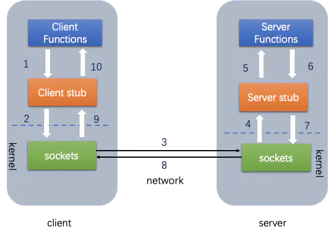

#1 GRPC

## 1.1 RPC

远程过程调用（Remote Procedure Call， RPC）是一个在分布式计算中的计算机通信协议。允许运行于一台计算机的程序调用另一个地址空间的子程序，在这个过程中使用者，可以就像调试本地程序一样，无需额外地为这个交互作用编程。RPC是一种服务端-客户端模式（CS）

**注：可以理解为一个节点请求另一个节点提供的服务。**

本地过程调用：如果将本地student对象的age+1，可以实现一个addAge（）方法，将student对象传入，对年龄进行更新之后返回即可，本地方法通过调用函数指针来指定。

远程过程调用：将addAge（）这个方法放在服务端，而执行函数的函数体在远程机器上。**（需要告诉机器去调用这个方法）**

方法**（需要告诉机器去调用这个方法）**：

1. 客户端需要告诉服务器，需要调用什么函数，这里的函数和进程ID存在一个映射**（客户端远程调用时，需要查一下函数，找到对应的ID，然后执行函数的代码。）**
2. 客户端需要把本地参数传递给远程函数，如果是本地调用的过程，直接压栈即可，但是在远程调用过程中不在同一个内存中，无法直接传递函数的参数，因此需要客户端把参数转换成字节流**（序列化）**，传给服务端，然后服务端将字节流转换成自身能读取的格式**（反序列化）**

3. 网络传输层需要把调用的ID和序列化后的参数传给服务端，然后把计算好的结果**序列化之后**传给客户端

**总结一下上述过程：**



```go
// Client端 
// Student student = Call(ServerAddr, addAge, student)
1. 将上面这个函数调用，映射为Call ID。
2. 将Call ID，student（params）序列化，以二进制形式打包
3. 把2中得到的数据包发送给ServerAddr，这需要使用网络传输层
4. 等待服务器返回结果
5. 如果服务器调用成功，那么就将结果反序列化，并赋给student，年龄更新

// Server端
1. 在本地维护一个Call ID到函数指针的映射call_id_map，可以用Map<String, Method> callIdMap
2. 等待客户端请求
3. 得到一个请求后，将其数据包反序列化，得到Call ID
4. 通过在callIdMap中查找，得到相应的函数指针
5. 将student（params）反序列化后，在本地调用addAge()函数，得到结果
6. 将student结果序列化后通过网络返回给Client
```


- 在微服务的设计中，一个服务A如果访问另一个Module下的服务B，可以采用HTTP REST传输数据，并在两个服务之间进行序列化和反序列化操作，服务B把执行结果返回过来。


- 由于HTTP在应用层中完成，整个通信的代价较高，**远程过程调用中直接基于TCP**进行远程调用，数据传输在传输层TCP层完成，**更适合对效率要求比较高的场景**，RPC主要依赖于客户端和服务端之间建立Socket链接进行，底层实现比REST更复杂。

## 1.2 gRPC

grpc是一种rpc的框架，能够运行在各种环境下。使用http2作为传输协议。

在grpc里面客户端，可以像调用本地方法一样直接调用其他机器上的服务端应用程序的方法，可以更容易创建分布式应用程序和服务。与许多rpc系统一样，grpc是基于**定义一个服务**，指定一个可以远程调用的**带有参数和返回类型的方法**。在**服务端程序**中实现这个**接口**并运行grpc服务，用于处理客户端调用。

**在客户端，有一个stub提供和服务端相同的方法**


**优点：**

使用grpc，可以一次性的在一个`.proto`文件中定义服务，并使用任何支持它的语言去实现客户端和服务端。通过`.proto`文件解决了不同语言**（Java与ruby）**以及环境之间通信的复杂性。


#2  .proto文件

protobuf是一种高效的平台无关、语言无关、可拓展的数据格式。作为go语言rpc接口实现的基础工具。

## 2.1 protobuf的使用

需要先**编写IDL文件**，然后**借助工具生成go语言代码**，从而**实现数据的序列化与反序列化**。

## 2.2 protobuf的语法

- 手册：https://colobu.com/2017/03/16/Protobuf3-language-guide/ 

- 博客：https://www.cnblogs.com/tohxyblog/p/8974763.html

定义一个消息类型：

- 定义一个“搜索请求”的消息格式，每个请求含有一个查询字符串、查询结果所在的页数、以及每一页多少条的查询结果。
- 定义如下:

  ```protobuf
  syntax = "proto3";//文件的第一行指定了你正在使用proto3语法
  
  //SearchRequest消息类型有3个字段，在消息中承载的数据分别对应于每一个字段。其中每个字段都有一个名字和一种类型。
  message SearchRequest {
        string query = 1;
        int32 page_number = 2;
        int32 result_per_page = 3;
  }
  
  // 搜索响应 消息类型
  message SearchResponse {
   ...
  }


- 对go来说，编译器会为每个消息类型生成了一个.pd.go文件。


## 2.3 使用protobuf编写go客户端

1. 在`protobuf_demo/address`目录下新建一个`person.proto`文件，**只需要定义类型即可其他的并不需要关心**。

```protobuf
// 此处使用v3版本
syntax = "proto3";

// 包名，通过protoc生成go文件
package address;

// 性别类型
// 枚举类型第一个字段必须为0
enum GenderType {
    SECRET = 0;
    FEMALE = 1;
    MALE = 2;
}

// 人
message Person {
    int64 id = 1;
    string name = 2;
    // 上面定义个性别类型
    GenderType gender = 3;
    string number = 4;
}

// 联系簿 这是一个嵌套的消息类型
message ContactBook {
    repeated Person persons = 1;
}
```

2. 在`protobuf_demo/address`目录下执行以下命令，此时在当前目录下会生成一个`person.pb.go`文件

```shell
address $ protoc --go_out=. ./person.proto 
```

3. 在主函数中使用生成的`person.pb.go`文件

```go
package main

import (
	"fmt"
	"io/ioutil"

	"github.com/golang/protobuf/proto"

	"github.com/Q1mi/studygo/code_demo/protobuf_demo/address"   // 引入protobuf生成的go文件 
)

// protobuf demo

func main() {
    // address.ContactBook是一个消息类型
	var cb address.ContactBook
	// 初始化变量，其数据类型与protobuf中定义的一样，作为待传入的消息
	p1 := address.Person{
		Name:   "小王子",
		Gender: address.GenderType_MALE,
		Number: "7878778",
	}
	fmt.Println(p1)
	cb.Persons = append(cb.Persons, &p1)
	// 序列化
	data, err := proto.Marshal(&p1)
	if err != nil {
		fmt.Printf("marshal failed,err:%v\n", err)
		return
	}
	ioutil.WriteFile("./proto.dat", data, 0644)

	data2, err := ioutil.ReadFile("./proto.dat")
	if err != nil {
		fmt.Printf("read file failed, err:%v\n", err)
		return
	}
	var p2 address.Person
	proto.Unmarshal(data2, &p2)
	fmt.Println(p2)
}
```


# 3 grpc入门示例

gRPC是基于Protocol Buffers。

关于`Protocol Buffers`的教程可以自行在网上搜索，本文默认读者熟悉`Protocol Buffers`。

## 3.1 编写IDL文件，并生成go语言代码，实现序列化与反序列化

**定义了两个服务SayHello，SayName及对应的四个消息（message）。**

```protobuf
syntax = "proto3" ;

//package myproto ;      #上面注释掉是因为报错 参考https://www.cnblogs.com/tomtellyou/p/12936651.html这篇文章第七点#https://learnku.com/articles/43758
option go_package = ".;protoes"; 

//定义服务 
service HelloServer {
  rpc SayHello (HelloReq) returns (HelloRsp){}
  rpc SayName (NameReq) returns (NameRsp){}
}

//客户端发送给服务端
message HelloReq {
  string name = 1 ;
}

//服务端返回给客户端
message HelloRsp {
  string msg = 1 ;
}

//客户端发送给服务端
message NameReq {
  string name = 1 ;
}

//服务端返回给客户端
message NameRsp {
  string msg = 1 ;
}
```

执行下面的命令，生成go语言源代码：

```bash
protoc -I helloworld/ helloworld/pb/helloworld.proto --go_out=plugins=grpc:helloworld
```

在`gRPC_demo/helloworld/pb`目录下会生成`helloworld.pb.go`文件。

## 3.2 编写Server端Go代码

```go
package main     


import (
    "fmt"
    "net"
    "google.golang.org/grpc"
    pd "demo/myproto"  //导入proto
    "context"
)

type server struct {}

func (this *server) SayHello(ctx context.Context, in *pd.HelloReq) (out *pd.HelloRsp,err error) {
    return &pd.HelloRsp{Msg:"hello"}, nil
}

func (this *server) SayName(ctx context.Context, in *pd.NameReq) (out *pd.NameRsp,err error){
    return &pd.NameRsp{Msg:in.Name + "it is name"}, nil
}

func main()  {
    ln, err := net.Listen("tcp", ":10088")
    if err != nil {
        fmt.Println("network error", err)
    }

    //创建grpc服务
    srv := grpc.NewServer()
    //注册服务
    pd.RegisterHelloServerServer(srv, &server{})
    err = srv.Serve(ln)
    if err != nil {
        fmt.Println("Serve error", err)
    }
}
```

将上面的代码保存到`gRPC_demo/helloworld/server/server.go`文件中，编译并执行：

```bash
cd helloworld/server
go build
./server
```

## 3.3 编写Client端Go代码

```go
package main     

import (
    "fmt"
    "google.golang.org/grpc"
    pd "demo/myproto"  //导入proto
    "context"
)

func main() {
    //客户端连接服务端
    conn, err := grpc.Dial("127.0.0.1:10088", grpc.WithInsecure())
    if err != nil {
        fmt.Println("network error", err)
    }

    //网络延迟关闭
    defer  conn.Close()
    //获得grpc句柄
    c := pd.NewHelloServerClient(conn)
    //通过句柄进行调用服务端函数SayHello
    re1, err := c.SayHello(context.Background(),&pd.HelloReq{Name:"songguojun"})
    if err != nil {
        fmt.Println("calling SayHello() error", err)
    }
    fmt.Println(re1.Msg)

    //通过句柄进行调用服务端函数SayName
    re2, err := c.SayName(context.Background(),&pd.NameReq{Name:"songguojun"})
    if err != nil {
        fmt.Println("calling SayName() error", err)
    }
    fmt.Println(re2.Msg)
}
```

将上面的代码保存到`gRPC_demo/helloworld/client/client.go`文件中，编译并执行：

```shell
cd helloworld/client/
go build
./client
```

得到输出如下（注意要先启动server端再启动client端）：

```shell
$ ./client 
Greeting: Hello q1mi!
```

此时我们的目录结构如下：

```bash
./gRPC_demo
├── go.mod
├── go.sum
└── helloworld
    ├── client
    │   ├── client
    │   └── client.go
    │   ├── client.py
    ├── pb
    │   ├── helloworld.pb.go
    │   └── helloworld.proto
    └── server
        ├── server
        └── server.go
```


